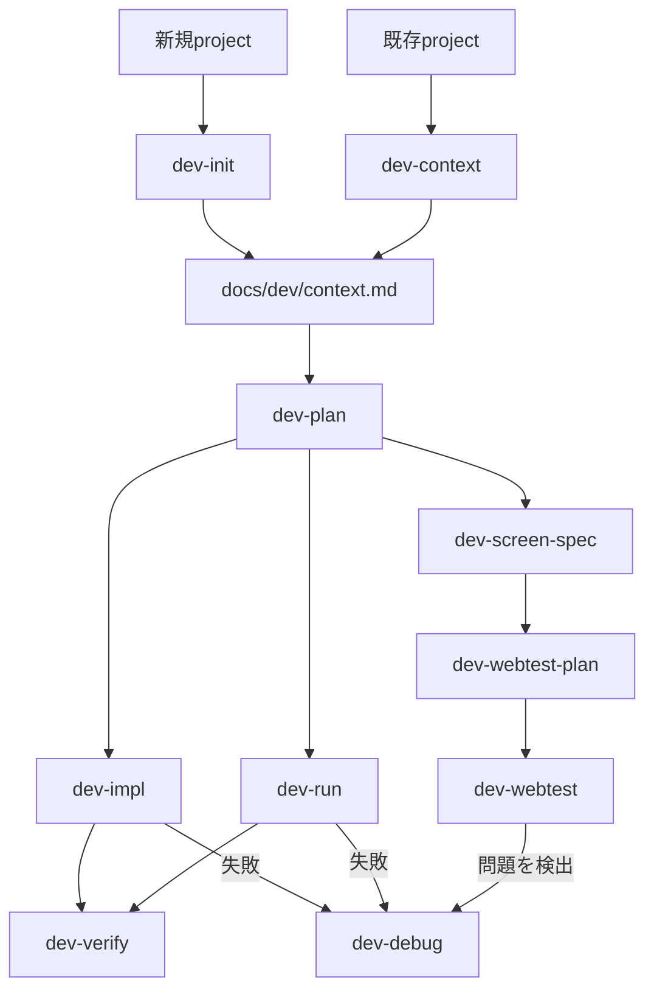

# AI エージェント

## snippet を使わずに起動する

### ホスト

初回は `~/.claude` の設定（`projects` / `settings.json` / `agents` / `skills` / `plugins`）を共有する symlink を作ります。
devcontainer の post-create でも同じ symlink を作るので、一度 devcontainer を起動していれば不要です。

```bash
for account in claude-account2 claude-work3; do
  mkdir -p ~/."$account"
  for entry in projects settings.json agents skills plugins; do
    [ -e ~/.claude/"$entry" ] || continue
    [ -e ~/."$account"/"$entry" ] || [ -L ~/."$account"/"$entry" ] || ln -s ../.claude/"$entry" ~/."$account"/"$entry"
  done
done
```

```bash
# account2 のアカウント
CLAUDE_CONFIG_DIR=~/.claude-account2 claude --dangerously-skip-permissions

# work3 のアカウント
CLAUDE_CONFIG_DIR=~/.claude-work3 claude --dangerously-skip-permissions
```

### devcontainer

`devcontainer exec` の `--` 以降がコンテナ内で実行されます。先に `dcup` で起動しておきます。
`~/.claude-account2` と `~/.claude-work3` は base template でコンテナへ mount しています。

```bash
# account2 のアカウントで Claude Code を起動
devcontainer exec --workspace-folder . --config ~/.config/devcontainer/devcontainer.json \
  -- env CLAUDE_CONFIG_DIR=/home/vscode/.claude-account2 claude --dangerously-skip-permissions

# work3 のアカウントで Claude Code を起動
devcontainer exec --workspace-folder . --config ~/.config/devcontainer/devcontainer.json \
  -- env CLAUDE_CONFIG_DIR=/home/vscode/.claude-work3 claude --dangerously-skip-permissions
```

multi-worktree の task root では `--config` を省略します（task root に生成された
`.devcontainer/devcontainer.json` が使われます）。

## ステータスライン（prompt cache カウントダウン）

Claude Code はメッセージを送るたびに会話全体をモデルへ再送信します。prompt cache が
効いている（warm）間は前回までの処理を再利用できるので、返信が速く、使用制限への影響も
小さくなります。cache は TTL で期限切れ（cold）になり、その後の最初のメッセージは
会話全体を最初から処理し直します。ステータスラインには cache の残り時間を表示し、
cold になったら次のメッセージで再キャッシュされるトークン数を表示します。
左端には作業ディレクトリの git branch を表示します。

`claude/statusline.sh`（`~/.claude/statusline.sh` に配置）が描画します。
`claude/settings.json` の `statusLine.refreshInterval: 30` で、カウントダウンを
30 秒ごとに更新します。Claude Code v2.1.251 以降と `jq` が必要です。
`claude/` は symlink-each で `~/.claude` へ配置されます。初回は `mise bootstrap dotfiles apply`
で symlink を作成し、以降の `claude/` の変更はそのまま反映されます。

### 表示の読み方

```text
main · cache ● 1h ████░░ 38m left · hit 91% · misses 0
main · cache ○ cold · next message re-caches 82k tokens · last miss: ttl_expired_5m
```

| 表示                                | 意味                                                                                                                                                    |
| ----------------------------------- | ------------------------------------------------------------------------------------------------------------------------------------------------------- |
| `main`（シアン）                    | 作業ディレクトリの git branch。detached HEAD のときは短縮 SHA、git 管理外では表示しない                                                                 |
| `●`（緑）                           | cache が warm。次のメッセージは cache を再利用できる                                                                                                    |
| `●`（黄）                           | warm だが、残り時間が TTL の 20% 未満。続けて聞きたいことがあれば今のうちに送る                                                                         |
| `○ cold`（赤）                      | cache が warm でない（TTL 切れ、または直近の応答に cache token が無い）。次のメッセージで会話全体を処理し直す                                           |
| `– waiting`（灰）                   | まだ `prompt_cache` が届いていない（セッションの最初の応答前、または Claude Code が v2.1.251 未満）                                                     |
| `– not observed`（灰）              | このセッションでまだ cache token が報告されていない（`prompt_cache.caching_observed` が `false`。caching が無効、または provider/gateway が報告しない） |
| `1h` / `5m`                         | 現在の cache の TTL（`prompt_cache.ttl`）                                                                                                               |
| `████░░`                            | TTL に対する残り時間の割合（6 マス）                                                                                                                    |
| `38m left`                          | cold になるまでの残り時間（`prompt_cache.expires_at` から計算。1 分未満は秒）                                                                           |
| `hit 91%`                           | このセッションの入力トークンのうち cache から読めた割合（`prompt_cache.hit_ratio`）                                                                     |
| `misses 0`                          | cache にあるはずの内容を処理し直したリクエスト数（`prompt_cache.misses`）。compaction などによる想定内の再構築は含まない                                |
| `next message re-caches 82k tokens` | cold のとき、次のメッセージで再キャッシュされるトークン数（`prompt_cache.recache_tokens_if_cold`、k 単位で丸め）                                        |
| `last miss: ...`                    | 直近の miss の推定原因（`prompt_cache.last_miss_cause.causes`）。原因が分かったときだけ表示                                                             |

`prompt_cache` は main conversation の最初の API 応答後に入力へ現れるため、それまでは
灰色で `cache – waiting` を表示します（Claude Code が v2.1.251 未満の場合もこの表示のままです）。使っている Claude Code のバージョンに無いフィールドは表示を省きます。
subagent のリクエストはこの統計に含まれません。

### cache を長持ちさせるための注意

- 既定の cache TTL は、サブスクリプションのプラン内利用では main conversation が 1 時間、
  subagent と workflow が 5 分です。API キー利用時や、使用制限を超えて使用クレジットに
  移ったときは、main conversation も 5 分になります。TTL は main conversation なら
  `promptCacheTtl`（または `CLAUDE_CODE_PROMPT_CACHE_TTL`）、subagent などは
  `subagentPromptCacheTtl`（または `CLAUDE_CODE_SUBAGENT_PROMPT_CACHE_TTL`）で `5m` / `1h`
  に変更できます（v2.1.242 以降）。
- セッション中にモデルを切り替えると cache はすべて作り直しになります。`opusplan` では
  plan mode への出入りも切り替えとして扱われます。
- プロジェクトルートとユーザーレベルの `CLAUDE.md` はセッション開始時に読み込まれます。
  セッション中に編集しても cache は壊れませんが、編集内容は `/clear`・`/compact`・再起動の
  いずれかまで反映されません。サブディレクトリの nested `CLAUDE.md` や `paths:` 付きの
  rule は必要になった時点で読み込まれるため、読み込まれる前の編集はそのまま反映されます。
- やり直したいときは `/rewind` で戻ると既存の cache を再利用できます。`/compact` は
  新しい cache を作ります。

### cache を意識した使い方

基本は「cache が warm のうちに続けて指示を送る」方が得です。ただし、cache を保つためだけに
メッセージを送るのは、多くの場合は得になりません。

#### なぜ warm のうちに送ると得か

以下の「〜倍」は、cache を使わない通常の入力トークンの料金を 1 としたときの比率です
（API 料金での目安）。

| 入力の種類                   | 料金の比率                                  |
| ---------------------------- | ------------------------------------------- |
| 通常の入力（cache なし）     | 1 倍                                        |
| cache から読む（hit）        | 約 0.1 倍（9 割引）                         |
| cache に書き込む（作り直し） | 5 分 TTL で約 1.25 倍、1 時間 TTL で約 2 倍 |

- warm のうちは、会話の大部分を約 0.1 倍で読めます。
- cold になると、会話全体をもう一度 cache に書き込みます。通常の入力より高い 1.25 倍 / 2 倍が
  会話全体にかかります。
- API キーではこの比率がそのまま請求額に効きます。サブスクリプションでは直接の請求はありませんが、
  同じ比率で使用制限の減り方に効きます。返信も速くなります。
- cache に当たるたびに TTL はリセットされます。続けてやり取りしている間はずっと warm のままです。

#### hit 率と料金の関係

hit 率（ステータスラインの `hit 91%`）が高いほど入力の料金は下がります。ただし反比例ではなく、
ほぼ直線的に下がります。書き込みの割増しを除いた入力料金の目安は次のとおりです。

```text
入力料金 ≈ (1 − hit 率) × 1 + hit 率 × 0.1
```

式の hit 率は 0〜1 の割合です（`hit 91%` なら 0.91）。

| hit 率 | 入力料金（cache なしとの比） |
| ------ | ---------------------------- |
| 0%     | 1.0 倍                       |
| 50%    | 約 0.55 倍                   |
| 90%    | 約 0.19 倍                   |

- 下がるのは入力の料金だけです。出力トークンの料金は cache の有無で変わりません。
- cold になるたびに会話全体を割増し（1.25 倍 / 2 倍）で書き直すので、実際の損は hit 率の
  数字から見えるより大きくなります。

#### 実際の使い方

1. 同じ作業の続きなら、間を空けずに送ります。黄色（残り 20% 未満）になっていて、
   まだ聞きたいことがあるなら、今のうちに聞きます。
2. cache を保つためだけの「つなぎ」の送信は基本しません。その送信自体にも cache 読み込みと
   出力の分のコストがかかります。元を取れるのは、TTL 内に確実に作業を再開し、つなぎの
   送信のコスト（会話全体の cache 読み込み ≈ 0.1 倍＋つなぎメッセージ自体の入力＋出力）が cold 後の再書き込み
   （1.25 倍 / 2 倍）より小さくなる場合だけです。会話の長さ・出力量・モデルによって
   変わるので、固定の目安はありません。
3. cold になったら、送る前に続けるかどうかを考えます。ステータスラインの
   `next message re-caches 82k tokens` がその再送のコストです。
   - 前の文脈がもう要らないなら、`/clear` で新しく始めた方が安いです。
   - 文脈は要るけれど長すぎるなら、`/compact` で縮める手もあります。ただし cold 時の
     `/compact` は要約を作るために会話全体を cache なしで処理し直すので、`/compact`
     としては最もコストが高くなります。縮めた文脈でこの後も何度もやり取りする場合に
     元が取れます。`/compact` はなるべく warm のうち（作業の区切り）に実行します。
4. 話題が変わるときは、cold かどうかに関係なく `/clear` します。関係のない長い履歴を
   毎回送り続けるのは、cache が効いていても無駄です。
5. cache を壊す操作に注意します。モデルの切り替えや、`opusplan` での plan mode の出入りは、
   warm でも cache を作り直しにします。

まとめると、作業はまとまった時間で一気に進め、区切りでは warm のうちに `/compact` し、
休憩明けで cold になっていたら、続けるか `/clear` するかを選ぶのが一番得な使い方です。

参考: [Customize your status line — Prompt cache fields](https://code.claude.com/docs/en/statusline#prompt-cache-fields) /
[How Claude Code uses prompt caching](https://code.claude.com/docs/en/prompt-caching)

## 外部 skill の使い方

このページでは、`apm/apm.yml` で導入している次の skill の使い方を説明します。

- Plannotator / Effective HTML skills
- `crit` / `crit-cli`
- `terminal-browser`
- Tsumiki skills
- Ponytailの6 skill
- `ctx-agent-history-search`
- `resolving-merge-conflicts`
- `grill-me`（内部で `grilling` を使用）
- `diagram-design`
- `find-skills`

### インストール

設定を反映してから APM を実行します。

```bash
mise bootstrap dotfiles apply
mise --cd "$HOME" run apm:install
```

`mise run apm:install` は user scope で skill をインストールします。Claude Code では
`~/.claude/skills/`、Codex・GitHub Copilot・Cursor では共通の `~/.agents/skills/` に配置されます。
インストール後は、エージェントを新しいセッションで起動してください。

依存先は再現性のため `apm/apm.yml` で commit SHA またはrelease tagに pin しています。更新時は upstream の内容を確認して
`ref` を変更し、もう一度 `mise bootstrap dotfiles apply` と `mise --cd "$HOME" run apm:install` を実行します。

### Plannotator / Effective HTML

#### 導入構成

- Plannotator CLIはdevcontainer imageのmise toolとしてインストールします。
- `plannotator-review`、`plannotator-annotate`、`plannotator-last`とEffective HTMLの6 skillsは
  APMでuser scopeへ配布します。
- APMのskillはClaude Codeでは`/<skill-name>`、Codexでは`$<skill-name>`として呼び出せるため、
  Plannotator用のslash command fileを別途管理しません。
- Claude Codeのplan review hookはRulesyncのglobal hook、Codexのplan review hookは`~/.codex/hooks.json`で
  設定します。どちらもplan終了時にCLIを呼び、Plannotatorが未インストールのhostでは何もせず終了します。
- code、HTML、agent responseのreviewはhookでは自動起動せず、次のskillを明示的に呼び出します。

#### HTML artifactを作成してreviewする

[Effective HTML](https://github.com/plannotator/effective-html)のskillは、作りたいartifactに合わせて使い分けます。

| skill              | 使いどころ                                                  |
| ------------------ | ----------------------------------------------------------- |
| `$html`            | report、explainer、presentation、landing pageなどの汎用HTML |
| `$design-artifact` | palette、typography、layoutなどのvisual directionを決める   |
| `$html-wireframe`  | 情報設計や導線を確認するlow-fidelity wireframe              |
| `$html-prototype`  | 見た目を確認するmockup、または操作できるprototype           |
| `$html-plan`       | plan、roadmap、rollout、実装手順                            |
| `$html-diagram`    | architecture、sequence、process、state、hierarchyのdiagram  |

`$html`は汎用の入り口です。作るものがwireframeやprototypeと明確な場合は、
対応するspecialist skillを直接指定します。`$design-artifact`は他のskillと組み合わせて
visual directionを調整する場合に使えます。

```text
$html-wireframe 管理画面の情報階層と2つの導線案をHTMLで作成して

$html-prototype ユーザー登録から完了までの操作可能なprototypeをHTMLで作成して

$design-artifact $html-plan この実装planをprojectのdesign languageに合わせて可視化して
```

作成したHTMLはPlannotator skillからreviewできます。Plannotatorはskill実行時に起動するため、
container起動時にPlannotatorを常駐起動する必要はありません。

```text
$plannotator-annotate path/to/artifact.html
```

CLIを直接実行する場合は次を使います。

```bash
plannotator annotate path/to/artifact.html
```

#### 開発中のfrontendをreviewする

devcontainer内でfrontendのdev serverを起動します。Expo Webの例では次を実行します。

```bash
npx expo start --web --host lan
```

Viteなど、任意のhostからのaccessを明示的に許可するdev serverは次のように起動します。

```bash
npm run dev -- --host 0.0.0.0
```

dev serverが表示したloopback URLを別のterminalまたはagent sessionからPlannotatorへ渡します。
`--app`はlive annotationを必須にし、pageを開けない場合はstatic contentへ自動fallbackせずerrorを返します。

```text
$plannotator-annotate http://localhost:8081 --app
```

CLIで直接起動する場合は次のとおりです。Viteの例ではportを`5173`に変えます。

```bash
plannotator annotate 'http://localhost:8081' --app
plannotator annotate 'http://localhost:5173/admin?tab=users' --app
```

Plannotatorはdev serverを内部のrandom portでreverse proxyします。review起動時にeditor portと
このlive-app proxy portを同じport番号のままSSH reverse tunnelでmacOSへ公開し、browserで自動的に開きます。
URLとCSPのoriginがcontainer内とhost側で一致するため、live iframeも表示できます。
review中もnavigation、form操作、hot reload、WebSocketを利用できます。pen toolで要素をclickするか
textを選択してcommentを付け、**Send Annotations**でfeedbackをagentへ戻します。

tabを自動で閉じたくない場合は、Plannotator右上の**Settings**を開き、
**Auto-close Tab**を**Off**にします。この選択はbrowserに保存されるため、以後のreviewにも適用されます。
ただし、**Send Annotations**は現在のCLI sessionを完了させる操作です。tabを残しても完了画面になり、
同じannotation UIやlive appを引き続き操作することはできません。agentがfeedbackを反映した後に
`$plannotator-annotate <URL> --app`をもう一度実行し、新しいreview sessionで確認してください。
critのように1つの画面をfeedback送信後も継続利用する動作は、Plannotatorの現行session modelでは利用できません。

live modeで開けないpageをcontentとしてreviewする場合は、snapshot取得を明示します。

```bash
plannotator annotate 'http://localhost:8081' --static --no-jina
```

host側のPlannotator URLで「接続が拒否されました」と表示される場合は、tunnelの状態とlogを確認します。

```bash
ps -ef | grep '[s]sh.*127.0.0.1:19433'
cat ~/.cache/plannotator-tunnels/19433.log
```

`plannotator-browser`はreview起動ごとに必要な2本のtunnelを起動します。複数のdevcontainerが同時に
Plannotatorを使うとeditor portの`19433`が衝突するため、reviewするcontainerは1つだけにしてください。
`19433`は`devcontainer.json`の`PLANNOTATOR_PORT`です。変更する場合は、この確認commandも同じ値に読み替えます。
Plannotatorとdev serverのprocessは、review中はterminalで終了させないでください。

#### code diffをreviewする

current branchの変更は次のskillでreviewします。

```text
$plannotator-review
```

GitHub PRをreviewする場合はPR URLを渡します。

```text
$plannotator-review https://github.com/owner/repository/pull/123
```

#### agentの最後の返答をreviewする

```text
$plannotator-last
```

### `crit` / `crit-cli`

#### 用途

`crit`はcode diff、plan、ローカルHTML、実行中のWeb applicationをbrowser UIで確認し、行や要素へcommentを付けて
エージェントへ戻すreview skillです。`crit-cli`はcommentの作成・返信、reviewの共有、GitHub PRとの同期などを
エージェントがCLIから操作するための補助skillであり、通常は直接起動しません。

#### 使い方

`crit`はユーザーが明示的に起動します。Claude Codeでは`/crit`、Codexでは`$crit`を使い、必要に応じてreview対象を
指定します。

```text
/crit docs/plan.md
```

```text
$crit を使って、現在のgit diffをreviewできるようにしてください。
```

devcontainerでは`crit`を起動した後、表示されたhost側URLをbrowserで開きます。commentを送信するとエージェントが
修正し、再reviewできます。CLIの構成、PR commentのpull / push、tool比較は[`docs/crit.md`](crit.md)を参照してください。

### `terminal-browser`

#### 用途

terminal pane内に実browserを表示し、エージェントが同じtabに対してsnapshot、click、入力、JavaScript評価を行うskillです。
Web applicationの動作確認、生成したHTMLの可視化、browser上でしか確認できない状態の調査に使用します。

#### 使い方

browserで確認したいURLと操作内容を自然言語で伝えます。明示的に指定する場合は、Claude Codeでは
`/terminal-browser`、Codexでは`$terminal-browser`を使用します。

```text
$terminal-browser を使って http://localhost:3000 を開き、login formを操作してerrorがないか確認してください。
```

skillは必要に応じてterminalを分割し、`terminal-browser action`で開いているtabを操作します。認証情報や個人情報を
入力させる場合は、実行する操作と送信先を事前に確認してください。

### Tsumiki skills

Tsumikiは、project初期化、context生成、plan作成、TDD実装、検証、debug、Web test、security checkをつなぐ開発workflowです。
依頼内容に応じて自動選択されますが、Claude Codeでは`/<skill-name>`、Codexでは`$<skill-name>`で明示できます。

| skill                | 用途                                                                                         |
| -------------------- | -------------------------------------------------------------------------------------------- |
| `dev-context`        | projectの技術stack、test framework、規約、architectureを分析し、context fileを生成・更新する |
| `dev-debug`          | test失敗、build・compile error、環境問題を分類し、原因を絞って修正する                       |
| `dev-impl`           | plan内のtaskまたは直接指定した小規模変更を、TDDをguardrailとして実装する                     |
| `dev-init`           | 対話で新規projectの技術stackを決め、承認後にscaffoldとcontextを生成する                      |
| `dev-navigate`       | 目的を聞き取り、使用するTsumiki skillと実行順序を案内する                                    |
| `dev-plan`           | 要件をinterface-firstの設計とtest可能なtaskへ分解し、`docs/dev/plans/`へ保存する             |
| `dev-run`            | plan内のtask範囲を`dev-impl`、`dev-verify`、`dev-debug`のflowで連続実行する                  |
| `dev-screen-spec`    | source codeまたはplanから画面仕様を生成し、既存仕様を差分更新する                            |
| `dev-verify`         | planの完了状態とtest・build・lintの整合性を検証し、reportを出力する                          |
| `dev-webtest-plan`   | dev planや画面仕様からPlaywright用のWeb test planを生成・更新する                            |
| `dev-webtest`        | Playwrightで画面動作、visual、accessibility、responsive、formをtestする                      |
| `ipa-security-check` | IPAの公開資料に基づいてsource codeを静的検査し、出典付きで脆弱性候補を報告する               |
| `ipa-security-guide` | security診断reportを読み、優先順位付きの`dev-debug`依頼リストへ変換する                      |
| `task-breakdown`     | 開発に限らない依頼を、依存関係と完了条件を持つ実行可能なtaskへ構造分解する                   |
| `uat-test-design`    | repositoryを分析し、業務・system・非機能の受入test項目を階層化して生成する                   |

最初にどのskillを使うべきか分からない場合は、次のように`dev-navigate`へ相談します。

```text
/dev-navigate
既存Web applicationへ決済機能を追加したいです。どの順番で進めるべきですか。
```

```text
$dev-plan checkout "決済providerを追加し、失敗時に安全にretryできるようにする"
```

既存projectで一連のworkflowを始める場合は、通常`dev-context` → `dev-plan` → `dev-impl`または`dev-run` →
`dev-verify`の順で使用します。Web UIを含む場合は`dev-webtest-plan`と`dev-webtest`、security確認が必要な場合は
`ipa-security-check`と`ipa-security-guide`を組み合わせます。

### Tsumiki 入門ガイド

#### 現行の中心は Dev Skills

Tsumikiの現行workflowはDev Skillsです。従来このページで中心としていたKairo・個別TDD・DIRECT commandは、upstreamで
`tsumiki-legacy` pluginへ分離されたlegacy機能です。新しい開発ではDev Skillsを使用し、Kairoを前提とした
`kairo-requirements` → `kairo-design` → `kairo-tasks`という手順は採用しません。

Dev Skillsは、新規projectの初期化または既存projectの分析から、計画、test-first実装、検証、debug、Web testまでを
次のようにつなぎます。



どこから始めるか判断できない場合は、`dev-navigate`へ目的を伝えます。

```text
/dev-navigate
既存Web applicationへ決済機能を追加したいです。どのskillから始めるべきですか。
```

#### 基本workflow

##### 1. Contextを準備する

新規projectでは`dev-init`が技術stackを対話で決定し、承認後にscaffoldします。既存projectでは`dev-context`が技術stack、
test framework、規約、architectureを分析します。どちらも後続skillが共有する`docs/dev/context.md`を生成します。

```text
/dev-init
```

```text
/dev-context
```

##### 2. Planを作る

`dev-plan`はinterface-firstの設計とtest可能なtaskを`docs/dev/plans/<plan-name>/`へ出力します。素早く計画する
Lightweight modeと、EARS要件、user story、受け入れ条件まで作るFull-spec modeがあり、実行中に選択します。

```text
/dev-plan auth "ユーザー認証機能を実装"
```

既存のPRDを入力にすることもできます。

```text
/dev-plan auth ./docs/prd.md
```

##### 3. 実装する

taskを1件ずつ実装する場合は`dev-impl`へplan名とtask IDを渡します。Planを作るほどではない軽微な変更には、修正指示を
直接渡すquick modeを使用できます。どちらもRed → Green → Refactorをguardrailとするtest-first実装です。

```text
/dev-impl auth 001
```

```text
/dev-impl "validation messageを日本語へ変更"
```

複数taskを連続実行する場合は`dev-run`へ対象範囲を渡します。各taskについて`dev-impl`、`dev-verify`、失敗時の
`dev-debug`を組み合わせて実行します。

```text
/dev-run auth 001 005
```

##### 4. 検証・debugする

`dev-verify`はplanのtask完了状態、test、build、lint、file sizeを確認し、
`docs/dev/plans/<plan-name>/reports/`へreportを出力します。

```text
/dev-verify auth
```

失敗の原因を調べて修正する場合は`dev-debug`を使用します。errorの自動検出、error messageの直接指定、Web testで
検出した問題を扱う`webtest` modeに対応します。

```text
/dev-debug "TypeError: Cannot read properties of undefined"
```

#### Web UIをtestする

Web UIを含む変更では、画面仕様、Playwright test計画、実行を分離します。

1. `dev-screen-spec`でsource codeまたはplanから`docs/dev/screen-specs/`へ画面仕様を生成・差分更新する。
2. `dev-webtest-plan`でplanと画面仕様からPlaywright用test計画を生成・差分更新する。
3. `dev-webtest`で計画test、monkey test、visual、accessibility、responsive、formを確認する。
4. 問題が見つかった場合は`dev-debug webtest`で修正する。

```text
/dev-screen-spec from-plan auth
/dev-webtest-plan auth
/dev-webtest auth
/dev-debug webtest
```

#### その他の現行command

Dev Skills以外にも、目的別のcommandを使用できます。

| カテゴリ            | 主なcommand                                                              | 用途                                                     |
| ------------------- | ------------------------------------------------------------------------ | -------------------------------------------------------- |
| DCS                 | `dcs:feature-rubber-duck`、`dcs:impact-analysis`、`dcs:bug-analysis`など | PRD作成、影響範囲・bug・performance・edge caseなどの分析 |
| utility             | `help`、`orchestrate`、`refine-plan`、`refine-execute`                   | command案内、複雑な依頼の編成、小規模変更の計画と実行    |
| error対応           | `auto-debug`、`build-fix`、`env-fix`、`flaky-fix`、`timeout-fix`         | test、build、環境、flaky test、timeoutの修正             |
| reverse engineering | `rev-tasks`、`rev-design`、`rev-specs`、`rev-requirements`               | 既存codeからtask、設計、test仕様、要件を逆生成           |

このdotfilesではTsumiki commandをRulesync経由でも配布します。Claude Codeでは`/tsumiki-<name>`、Codexでは
`$tsumiki-<name>`として呼び出します。たとえばhelpは`/tsumiki-help`または`$tsumiki-help`です。詳細は
[`docs/rulesync.md`](rulesync.md)を参照してください。

#### Legacy commandについて

Kairo、個別TDD、DIRECTが必要な既存workflowでは、upstreamの`tsumiki-legacy` pluginを明示的に導入し、Claude Codeで
`/tsumiki-legacy:<command>`として実行します。たとえばKairoの要件定義は
`/tsumiki-legacy:kairo-requirements`です。現行の`tsumiki` pluginだけを導入した環境では利用できません。

新規作業でKairoの成果物や手順をそのままDev Skillsへ読み替えないでください。Dev Skillsではcontextを
`docs/dev/context.md`、planを`docs/dev/plans/<plan-name>/`で管理し、個別のTDD commandではなく`dev-impl`が
test-first実装を担当します。

### Ponytail skills

Ponytailは、YAGNI、standard library、native platform機能、既存dependencyの順に検討し、要件を満たす最小の実装を
選ぶcoding workflowです。短いcodeを目的化するのではなく、security、accessibility、trust boundaryのvalidation、
data lossを防ぐerror handlingは省略しません。

| skill             | 用途                                                                                |
| ----------------- | ----------------------------------------------------------------------------------- |
| `ponytail`        | 最小の正しい実装を選ぶmode。`lite`、`full`、`ultra`の3段階を切り替えられる          |
| `ponytail-review` | 現在のdiffから過剰なabstraction、不要なdependency、再実装されたstdlibなどを探す     |
| `ponytail-audit`  | repository全体を対象に、削除・単純化できる箇所を優先順位付きで報告する              |
| `ponytail-debt`   | source内の`ponytail:` commentを収集し、意図的に先送りした制約と改善条件を一覧化する |
| `ponytail-gain`   | 公開benchmarkに基づくcode量、cost、処理時間への影響をscoreboardで表示する           |
| `ponytail-help`   | mode、skill、command、無効化方法をquick referenceとして表示する                     |

#### 使い方

通常modeは`full`です。Claude Codeでは`/ponytail`、Codexでは`$ponytail`を使い、必要に応じてlevelを指定します。

```text
/ponytail lite
このAPI clientへretryを追加してください。
```

```text
$ponytail ultra を使って、この変更を実現する最小のdiffを作ってください。
```

過剰実装だけをreviewするときは`ponytail-review`、repository全体を調べるときは`ponytail-audit`を使用します。これらは
correctness、security、performanceのreviewを置き換えないため、必要に応じて通常のcode reviewと併用してください。

```text
$ponytail-review を使って、現在のdiffから削除できるabstractionを探してください。
```

Ponytailを止めるときは「stop ponytail」または「normal mode」と伝えます。default levelを変える場合は
`PONYTAIL_DEFAULT_MODE`へ`lite`、`full`、`ultra`、`off`のいずれかを設定します。pluginのalways-on activationには
Node.jsで動くlifecycle hookを使用するため、非対話shellの`PATH`から`node`を実行できる必要があります。

### `ctx-agent-history-search`

#### 用途

ローカルに保存された過去のcoding-agent sessionを`ctx` CLIで検索し、以前の判断、試行、失敗理由、関連する会話を
現在の作業前に確認するskillです。同じrepositoryで過去の経緯が役立つ可能性があるときに自動的に使用されます。

#### 使い方

初回だけ`ctx setup`でindexを作成します。明示的に使う場合は、Claude Codeでは`/ctx-agent-history-search`、Codexでは
`$ctx-agent-history-search`を指定します。

```text
$ctx-agent-history-search を使って、以前database migrationに失敗したsessionとその原因を調べてください。
```

手動検索では`ctx search "query"`、詳細表示では`ctx show session <session-id>`などを使用します。setup、主要command、
local historyに含まれる秘密情報の注意点は[`docs/ctx.md`](ctx.md)を参照してください。

### `resolving-merge-conflicts`

#### 用途

進行中の `git merge` または `git rebase` で発生した conflict を、両方の変更意図を調べながら解消する skill です。
単に片側を採用するのではなく、commit・PR・issue などの一次情報を確認し、可能な限り双方の意図を保ちます。

#### 使い方

conflict が発生した状態で、エージェントに自然言語で依頼します。明示的に指定する場合は、Claude Code では
`/resolving-merge-conflicts`、Codex では `$resolving-merge-conflicts` を使用します。

```text
/resolving-merge-conflicts
現在の rebase conflict を、各 commit の意図を確認して解消してください。
```

```text
$resolving-merge-conflicts を使って、この merge conflict を解消してください。
```

skill は次の順に作業します。

1. merge/rebase の状態、履歴、conflict 対象を確認する。
2. 各変更の commit・PR・issue を調べ、意図を特定する。
3. conflict を hunk 単位で解消する。
4. リポジトリの typecheck・test・format などを実行する。
5. ファイルを stage し、merge commit または `git rebase --continue` まで完了する。

> [!IMPORTANT]
> この skill は進行中の merge/rebase を `--abort` せず、最後まで完了させる方針です。中断したい場合は、実行前に
> その旨を明示してください。また、作業ツリーに退避していない変更がないか事前に確認してください。

### `grill-me`

#### 用途

計画、設計、意思決定を実行に移す前に、未決定事項や暗黙の前提を質問によって洗い出す skill です。質問を
decision tree として扱い、前提が確定した時点で回答可能になる質問を round ごとに提示します。

`grill-me` はユーザーが明示的に起動する skill です。質問処理の本体である `grilling` も APM で一緒に
インストールされます。

#### 使い方

Claude Code では `/grill-me`、Codex では `$grill-me` に続けて検討対象を渡します。

```text
/grill-me
社内 API を外部パートナーへ公開する計画について、実装前に不足している判断を洗い出してください。
```

```text
$grill-me を使って、新しい CLI の配布方法を固めたいです。
```

各 round では複数の質問と推奨回答が提示されます。質問へ回答すると、その回答に依存する次の質問が提示されます。
すべての branch が解決すると interview は終了しますが、合意内容を実装へ移すのはユーザーが明示的に確認した後です。

効果的に使うため、最初の依頼には次を含めます。

- 達成したい結果と対象ユーザー
- 既に決まっていること
- 変更できない制約（期限、互換性、予算など）
- 特に不安な判断

### `diagram-design`

#### 用途

architecture、flowchart、sequence、ER、timeline、swimlane、quadrant、Gantt などの図を、inline SVG/CSS を含む
self-contained HTML として生成する skill です。文章や表より図の方が理解しやすい情報に使用します。

#### 初回セットアップ

最初の図を作るとき、skill は同梱の `references/style-guide.md` がデフォルトのままか確認します。デフォルトの場合は、
次のいずれかを選択します。

1. Web サイトの URL から色と font を抽出する。
2. インストール済み skill の design token を参照する。
3. ローカルの design system directory から抽出する。
4. token を手動で渡す。
5. デフォルトテーマをそのまま使う。

APM の再インストールや更新では配布先が再生成される可能性があります。ブランド設定を継続的に管理したい場合は、
upstream skill を直接編集せず、生成時に URL・design system・token を指定してください。

#### 使い方

作りたい図、含める要素、要素間の関係、出力先を自然言語で依頼します。skill は依頼内容から図の種類を選択します。
明示的に指定する場合は、Claude Code では `/diagram-design`、Codex では `$diagram-design` を使用します。

```text
/diagram-design
Web、API、PostgreSQL、Redis、外部決済サービスを含む architecture diagram を作り、
docs/architecture.html に保存してください。主要な request と data flow も表示してください。
```

```text
$diagram-design を使って、OAuth authorization code flow の sequence diagram を
docs/oauth-sequence.html に作成してください。
```

出力は build step や外部画像を必要としない HTML なので、browser で直接確認できます。

```bash
open docs/architecture.html # macOS
xdg-open docs/architecture.html # Linux
```

PNG または SVG が必要な場合は、生成後に自然言語で対象ファイルと形式を指定します。

```text
docs/architecture.html の図を SVG と PNG に export してください。
```

SVG は standalone file として生成されます。PNG export には Python 版 Playwright と Chromium が必要です。
未導入の場合は、export を依頼する前に次のコマンドを実行します。

```bash
pip install playwright
playwright install chromium
```

SVG は Google Fonts を外部参照するため、font を取得しない offline viewer などでは代替 font で表示される可能性が
あります。pixel-perfect な持ち運びが必要な場合は PNG を使用してください。diagram 生成時は、要素を詰め込みすぎず、
複雑な場合は overview と detail に分割してください。

### `find-skills`

#### 用途

実現したい作業に利用できる既存のagent skillを検索し、候補の品質を確認して提案するskillです。「この作業に使える
skillはあるか」「エージェントへ特定分野の能力を追加したい」といった依頼で使用します。

検索結果をそのまま勧めるのではなく、install数、配布元の信頼性、GitHub starsなどを確認してから候補を提示します。
適切なskillが見つからなかった場合は、通常のエージェント機能で作業を続けるか、独自skillを作る方法を提案します。

#### 使い方

skillは該当する依頼から自動的に選択されます。明示的に指定する場合は、Claude Codeでは`/find-skills`、Codexでは
`$find-skills`を使用し、探したい分野と具体的な作業を伝えます。

```text
/find-skills
Playwrightを使ったE2E testの設計と実装を支援するskillを探してください。
```

```text
$find-skills を使って、Pull Requestのreviewに利用できるskillを探してください。
```

skillは最初に[skills.sh](https://skills.sh/)のleaderboardを確認し、必要に応じてSkills CLIで検索します。

```bash
npx skills find "react performance"
npx skills find "pr review"
npx skills find testing --owner vercel-labs
```

候補が見つかると、用途、install数、配布元、install command、詳細ページが提示されます。提示されたskillをこの
dotfilesで継続管理する場合は、提案された`npx skills add`を直接実行するのではなく、upstreamを確認して
`apm/apm.yml`へcommit SHAまたはrelease tagでpinし、APMでインストールしてください。
