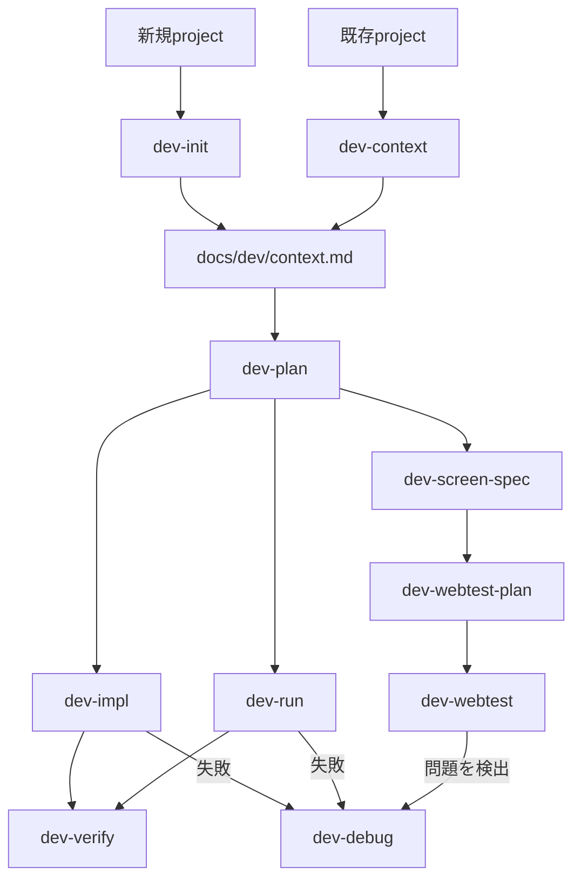
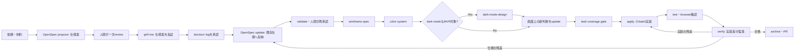

# 外部 skill の使い方

このページでは、`dot_apm/apm.yml` で導入している次の skill の使い方を説明します。

- Plannotator / Effective HTML skills
- `crit` / `crit-cli`
- `terminal-browser`
- Tsumiki skills
- Ponytailの6 skill
- `ctx-agent-history-search`
- `resolving-merge-conflicts`
- `grill-me`（内部で `grilling` を使用）
- `diagram-design`
- `wireframe-spec`
- `color-system`
- `dark-mode-design`
- `find-skills`

## インストール

設定を反映してから APM を実行します。

```bash
chezmoi apply
mise run apm:install
```

`mise run apm:install` は user scope で skill をインストールします。Claude Code では
`~/.claude/skills/`、Codex・GitHub Copilot・Cursor では共通の `~/.agents/skills/` に配置されます。
インストール後は、エージェントを新しいセッションで起動してください。

依存先は再現性のため `dot_apm/apm.yml` で commit SHA またはrelease tagに pin しています。更新時は upstream の内容を確認して
`ref` を変更し、もう一度 `chezmoi apply` と `mise run apm:install` を実行します。

## Plannotator / Effective HTML

### 導入構成

- Plannotator CLIはdevcontainer imageのmise toolとしてインストールします。
- `plannotator-review`、`plannotator-annotate`、`plannotator-last`とEffective HTMLの6 skillsは
  APMでuser scopeへ配布します。
- APMのskillはClaude Codeでは`/<skill-name>`、Codexでは`$<skill-name>`として呼び出せるため、
  Plannotator用のslash command fileを別途管理しません。
- Claude Codeのplan review hookはRulesyncのglobal hook、Codexのplan review hookは`~/.codex/hooks.json`で
  設定します。どちらもplan終了時にCLIを呼び、Plannotatorが未インストールのhostでは何もせず終了します。
- code、HTML、agent responseのreviewはhookでは自動起動せず、次のskillを明示的に呼び出します。

### HTML artifactを作成してreviewする

[Effective HTML](https://github.com/plannotator/effective-html)のskillは、作りたいartifactに合わせて使い分けます。

| skill              | 使いどころ                                                  |
| ------------------ | ----------------------------------------------------------- |
| `$html`            | report、explainer、presentation、landing pageなどの汎用HTML |
| `$design-artifact` | palette、typography、layoutなどのvisual directionを決める   |
| `$html-wireframe`  | 情報設計や導線を確認するlow-fidelity wireframe              |
| `$html-prototype`  | 見た目を確認するmockup、または操作できるprototype           |
| `$html-plan`       | plan、roadmap、rollout、実装手順                            |
| `$html-diagram`    | architecture、sequence、process、state、hierarchyのdiagram  |

`$html`は汎用の入り口です。作るものがwireframeやprototypeと明確な場合は、
対応するspecialist skillを直接指定します。`$design-artifact`は他のskillと組み合わせて
visual directionを調整する場合に使えます。

```text
$html-wireframe 管理画面の情報階層と2つの導線案をHTMLで作成して

$html-prototype ユーザー登録から完了までの操作可能なprototypeをHTMLで作成して

$design-artifact $html-plan この実装planをprojectのdesign languageに合わせて可視化して
```

作成したHTMLはPlannotator skillからreviewできます。Plannotatorはskill実行時に起動するため、
container起動時にPlannotatorを常駐起動する必要はありません。

```text
$plannotator-annotate path/to/artifact.html
```

CLIを直接実行する場合は次を使います。

```bash
plannotator annotate path/to/artifact.html
```

### 開発中のfrontendをreviewする

devcontainer内でfrontendのdev serverを起動します。Expo Webの例では次を実行します。

```bash
npx expo start --web --host lan
```

Viteなど、任意のhostからのaccessを明示的に許可するdev serverは次のように起動します。

```bash
npm run dev -- --host 0.0.0.0
```

dev serverが表示したloopback URLを別のterminalまたはagent sessionからPlannotatorへ渡します。
`--app`はlive annotationを必須にし、pageを開けない場合はstatic contentへ自動fallbackせずerrorを返します。

```text
$plannotator-annotate http://localhost:8081 --app
```

CLIで直接起動する場合は次のとおりです。Viteの例ではportを`5173`に変えます。

```bash
plannotator annotate 'http://localhost:8081' --app
plannotator annotate 'http://localhost:5173/admin?tab=users' --app
```

Plannotatorはdev serverを内部のrandom portでreverse proxyします。review起動時にeditor portと
このlive-app proxy portを同じport番号のままSSH reverse tunnelでmacOSへ公開し、browserで自動的に開きます。
URLとCSPのoriginがcontainer内とhost側で一致するため、live iframeも表示できます。
review中もnavigation、form操作、hot reload、WebSocketを利用できます。pen toolで要素をclickするか
textを選択してcommentを付け、**Send Annotations**でfeedbackをagentへ戻します。

tabを自動で閉じたくない場合は、Plannotator右上の**Settings**を開き、
**Auto-close Tab**を**Off**にします。この選択はbrowserに保存されるため、以後のreviewにも適用されます。
ただし、**Send Annotations**は現在のCLI sessionを完了させる操作です。tabを残しても完了画面になり、
同じannotation UIやlive appを引き続き操作することはできません。agentがfeedbackを反映した後に
`$plannotator-annotate <URL> --app`をもう一度実行し、新しいreview sessionで確認してください。
critのように1つの画面をfeedback送信後も継続利用する動作は、Plannotatorの現行session modelでは利用できません。

live modeで開けないpageをcontentとしてreviewする場合は、snapshot取得を明示します。

```bash
plannotator annotate 'http://localhost:8081' --static --no-jina
```

host側のPlannotator URLで「接続が拒否されました」と表示される場合は、tunnelの状態とlogを確認します。

```bash
ps -ef | grep '[s]sh.*127.0.0.1:19433'
cat ~/.cache/plannotator-tunnels/19433.log
```

`plannotator-browser`はreview起動ごとに必要な2本のtunnelを起動します。複数のdevcontainerが同時に
Plannotatorを使うとeditor portの`19433`が衝突するため、reviewするcontainerは1つだけにしてください。
`19433`は`devcontainer.json`の`PLANNOTATOR_PORT`です。変更する場合は、この確認commandも同じ値に読み替えます。
Plannotatorとdev serverのprocessは、review中はterminalで終了させないでください。

### code diffをreviewする

current branchの変更は次のskillでreviewします。

```text
$plannotator-review
```

GitHub PRをreviewする場合はPR URLを渡します。

```text
$plannotator-review https://github.com/owner/repository/pull/123
```

### agentの最後の返答をreviewする

```text
$plannotator-last
```

## `crit` / `crit-cli`

### 用途

`crit`はcode diff、plan、ローカルHTML、実行中のWeb applicationをbrowser UIで確認し、行や要素へcommentを付けて
エージェントへ戻すreview skillです。`crit-cli`はcommentの作成・返信、reviewの共有、GitHub PRとの同期などを
エージェントがCLIから操作するための補助skillであり、通常は直接起動しません。

### 使い方

`crit`はユーザーが明示的に起動します。Claude Codeでは`/crit`、Codexでは`$crit`を使い、必要に応じてreview対象を
指定します。

```text
/crit docs/plan.md
```

```text
$crit を使って、現在のgit diffをreviewできるようにしてください。
```

devcontainerでは`crit`を起動した後、表示されたhost側URLをbrowserで開きます。commentを送信するとエージェントが
修正し、再reviewできます。CLIの構成、PR commentのpull / push、tool比較は[`docs/crit.md`](crit.md)を参照してください。

## `terminal-browser`

### 用途

terminal pane内に実browserを表示し、エージェントが同じtabに対してsnapshot、click、入力、JavaScript評価を行うskillです。
Web applicationの動作確認、生成したHTMLの可視化、browser上でしか確認できない状態の調査に使用します。

### 使い方

browserで確認したいURLと操作内容を自然言語で伝えます。明示的に指定する場合は、Claude Codeでは
`/terminal-browser`、Codexでは`$terminal-browser`を使用します。

```text
$terminal-browser を使って http://localhost:3000 を開き、login formを操作してerrorがないか確認してください。
```

skillは必要に応じてterminalを分割し、`terminal-browser action`で開いているtabを操作します。認証情報や個人情報を
入力させる場合は、実行する操作と送信先を事前に確認してください。

## Tsumiki skills

Tsumikiは、project初期化、context生成、plan作成、TDD実装、検証、debug、Web test、security checkをつなぐ開発workflowです。
依頼内容に応じて自動選択されますが、Claude Codeでは`/<skill-name>`、Codexでは`$<skill-name>`で明示できます。

| skill                | 用途                                                                                         |
| -------------------- | -------------------------------------------------------------------------------------------- |
| `dev-context`        | projectの技術stack、test framework、規約、architectureを分析し、context fileを生成・更新する |
| `dev-debug`          | test失敗、build・compile error、環境問題を分類し、原因を絞って修正する                       |
| `dev-impl`           | plan内のtaskまたは直接指定した小規模変更を、TDDをguardrailとして実装する                     |
| `dev-init`           | 対話で新規projectの技術stackを決め、承認後にscaffoldとcontextを生成する                      |
| `dev-navigate`       | 目的を聞き取り、使用するTsumiki skillと実行順序を案内する                                    |
| `dev-plan`           | 要件をinterface-firstの設計とtest可能なtaskへ分解し、`docs/dev/plans/`へ保存する             |
| `dev-run`            | plan内のtask範囲を`dev-impl`、`dev-verify`、`dev-debug`のflowで連続実行する                  |
| `dev-screen-spec`    | source codeまたはplanから画面仕様を生成し、既存仕様を差分更新する                            |
| `dev-verify`         | planの完了状態とtest・build・lintの整合性を検証し、reportを出力する                          |
| `dev-webtest-plan`   | dev planや画面仕様からPlaywright用のWeb test planを生成・更新する                            |
| `dev-webtest`        | Playwrightで画面動作、visual、accessibility、responsive、formをtestする                      |
| `ipa-security-check` | IPAの公開資料に基づいてsource codeを静的検査し、出典付きで脆弱性候補を報告する               |
| `ipa-security-guide` | security診断reportを読み、優先順位付きの`dev-debug`依頼リストへ変換する                      |
| `task-breakdown`     | 開発に限らない依頼を、依存関係と完了条件を持つ実行可能なtaskへ構造分解する                   |
| `uat-test-design`    | repositoryを分析し、業務・system・非機能の受入test項目を階層化して生成する                   |

最初にどのskillを使うべきか分からない場合は、次のように`dev-navigate`へ相談します。

```text
/dev-navigate
既存Web applicationへ決済機能を追加したいです。どの順番で進めるべきですか。
```

```text
$dev-plan checkout "決済providerを追加し、失敗時に安全にretryできるようにする"
```

既存projectで一連のworkflowを始める場合は、通常`dev-context` → `dev-plan` → `dev-impl`または`dev-run` →
`dev-verify`の順で使用します。Web UIを含む場合は`dev-webtest-plan`と`dev-webtest`、security確認が必要な場合は
`ipa-security-check`と`ipa-security-guide`を組み合わせます。

## Tsumiki 入門ガイド

### 現行の中心は Dev Skills

Tsumikiの現行workflowはDev Skillsです。従来このページで中心としていたKairo・個別TDD・DIRECT commandは、upstreamで
`tsumiki-legacy` pluginへ分離されたlegacy機能です。新しい開発ではDev Skillsを使用し、Kairoを前提とした
`kairo-requirements` → `kairo-design` → `kairo-tasks`という手順は採用しません。

Dev Skillsは、新規projectの初期化または既存projectの分析から、計画、test-first実装、検証、debug、Web testまでを
次のようにつなぎます。



どこから始めるか判断できない場合は、`dev-navigate`へ目的を伝えます。

```text
/dev-navigate
既存Web applicationへ決済機能を追加したいです。どのskillから始めるべきですか。
```

### 基本workflow

#### 1. Contextを準備する

新規projectでは`dev-init`が技術stackを対話で決定し、承認後にscaffoldします。既存projectでは`dev-context`が技術stack、
test framework、規約、architectureを分析します。どちらも後続skillが共有する`docs/dev/context.md`を生成します。

```text
/dev-init
```

```text
/dev-context
```

#### 2. Planを作る

`dev-plan`はinterface-firstの設計とtest可能なtaskを`docs/dev/plans/<plan-name>/`へ出力します。素早く計画する
Lightweight modeと、EARS要件、user story、受け入れ条件まで作るFull-spec modeがあり、実行中に選択します。

```text
/dev-plan auth "ユーザー認証機能を実装"
```

既存のPRDを入力にすることもできます。

```text
/dev-plan auth ./docs/prd.md
```

#### 3. 実装する

taskを1件ずつ実装する場合は`dev-impl`へplan名とtask IDを渡します。Planを作るほどではない軽微な変更には、修正指示を
直接渡すquick modeを使用できます。どちらもRed → Green → Refactorをguardrailとするtest-first実装です。

```text
/dev-impl auth 001
```

```text
/dev-impl "validation messageを日本語へ変更"
```

複数taskを連続実行する場合は`dev-run`へ対象範囲を渡します。各taskについて`dev-impl`、`dev-verify`、失敗時の
`dev-debug`を組み合わせて実行します。

```text
/dev-run auth 001 005
```

#### 4. 検証・debugする

`dev-verify`はplanのtask完了状態、test、build、lint、file sizeを確認し、
`docs/dev/plans/<plan-name>/reports/`へreportを出力します。

```text
/dev-verify auth
```

失敗の原因を調べて修正する場合は`dev-debug`を使用します。errorの自動検出、error messageの直接指定、Web testで
検出した問題を扱う`webtest` modeに対応します。

```text
/dev-debug "TypeError: Cannot read properties of undefined"
```

### Web UIをtestする

Web UIを含む変更では、画面仕様、Playwright test計画、実行を分離します。

1. `dev-screen-spec`でsource codeまたはplanから`docs/dev/screen-specs/`へ画面仕様を生成・差分更新する。
2. `dev-webtest-plan`でplanと画面仕様からPlaywright用test計画を生成・差分更新する。
3. `dev-webtest`で計画test、monkey test、visual、accessibility、responsive、formを確認する。
4. 問題が見つかった場合は`dev-debug webtest`で修正する。

```text
/dev-screen-spec from-plan auth
/dev-webtest-plan auth
/dev-webtest auth
/dev-debug webtest
```

### その他の現行command

Dev Skills以外にも、目的別のcommandを使用できます。

| カテゴリ            | 主なcommand                                                              | 用途                                                     |
| ------------------- | ------------------------------------------------------------------------ | -------------------------------------------------------- |
| DCS                 | `dcs:feature-rubber-duck`、`dcs:impact-analysis`、`dcs:bug-analysis`など | PRD作成、影響範囲・bug・performance・edge caseなどの分析 |
| utility             | `help`、`orchestrate`、`refine-plan`、`refine-execute`                   | command案内、複雑な依頼の編成、小規模変更の計画と実行    |
| error対応           | `auto-debug`、`build-fix`、`env-fix`、`flaky-fix`、`timeout-fix`         | test、build、環境、flaky test、timeoutの修正             |
| reverse engineering | `rev-tasks`、`rev-design`、`rev-specs`、`rev-requirements`               | 既存codeからtask、設計、test仕様、要件を逆生成           |

このdotfilesではTsumiki commandをRulesync経由でも配布します。Claude Codeでは`/tsumiki-<name>`、Codexでは
`$tsumiki-<name>`として呼び出します。たとえばhelpは`/tsumiki-help`または`$tsumiki-help`です。詳細は
[`docs/rulesync.md`](rulesync.md)を参照してください。

### Legacy commandについて

Kairo、個別TDD、DIRECTが必要な既存workflowでは、upstreamの`tsumiki-legacy` pluginを明示的に導入し、Claude Codeで
`/tsumiki-legacy:<command>`として実行します。たとえばKairoの要件定義は
`/tsumiki-legacy:kairo-requirements`です。現行の`tsumiki` pluginだけを導入した環境では利用できません。

新規作業でKairoの成果物や手順をそのままDev Skillsへ読み替えないでください。Dev Skillsではcontextを
`docs/dev/context.md`、planを`docs/dev/plans/<plan-name>/`で管理し、個別のTDD commandではなく`dev-impl`が
test-first実装を担当します。

## Ponytail skills

Ponytailは、YAGNI、standard library、native platform機能、既存dependencyの順に検討し、要件を満たす最小の実装を
選ぶcoding workflowです。短いcodeを目的化するのではなく、security、accessibility、trust boundaryのvalidation、
data lossを防ぐerror handlingは省略しません。

| skill             | 用途                                                                                |
| ----------------- | ----------------------------------------------------------------------------------- |
| `ponytail`        | 最小の正しい実装を選ぶmode。`lite`、`full`、`ultra`の3段階を切り替えられる          |
| `ponytail-review` | 現在のdiffから過剰なabstraction、不要なdependency、再実装されたstdlibなどを探す     |
| `ponytail-audit`  | repository全体を対象に、削除・単純化できる箇所を優先順位付きで報告する              |
| `ponytail-debt`   | source内の`ponytail:` commentを収集し、意図的に先送りした制約と改善条件を一覧化する |
| `ponytail-gain`   | 公開benchmarkに基づくcode量、cost、処理時間への影響をscoreboardで表示する           |
| `ponytail-help`   | mode、skill、command、無効化方法をquick referenceとして表示する                     |

### 使い方

通常modeは`full`です。Claude Codeでは`/ponytail`、Codexでは`$ponytail`を使い、必要に応じてlevelを指定します。

```text
/ponytail lite
このAPI clientへretryを追加してください。
```

```text
$ponytail ultra を使って、この変更を実現する最小のdiffを作ってください。
```

過剰実装だけをreviewするときは`ponytail-review`、repository全体を調べるときは`ponytail-audit`を使用します。これらは
correctness、security、performanceのreviewを置き換えないため、必要に応じて通常のcode reviewと併用してください。

```text
$ponytail-review を使って、現在のdiffから削除できるabstractionを探してください。
```

Ponytailを止めるときは「stop ponytail」または「normal mode」と伝えます。default levelを変える場合は
`PONYTAIL_DEFAULT_MODE`へ`lite`、`full`、`ultra`、`off`のいずれかを設定します。pluginのalways-on activationには
Node.jsで動くlifecycle hookを使用するため、非対話shellの`PATH`から`node`を実行できる必要があります。

## `ctx-agent-history-search`

### 用途

ローカルに保存された過去のcoding-agent sessionを`ctx` CLIで検索し、以前の判断、試行、失敗理由、関連する会話を
現在の作業前に確認するskillです。同じrepositoryで過去の経緯が役立つ可能性があるときに自動的に使用されます。

### 使い方

初回だけ`ctx setup`でindexを作成します。明示的に使う場合は、Claude Codeでは`/ctx-agent-history-search`、Codexでは
`$ctx-agent-history-search`を指定します。

```text
$ctx-agent-history-search を使って、以前database migrationに失敗したsessionとその原因を調べてください。
```

手動検索では`ctx search "query"`、詳細表示では`ctx show session <session-id>`などを使用します。setup、主要command、
local historyに含まれる秘密情報の注意点は[`docs/ctx.md`](ctx.md)を参照してください。

## `resolving-merge-conflicts`

### 用途

進行中の `git merge` または `git rebase` で発生した conflict を、両方の変更意図を調べながら解消する skill です。
単に片側を採用するのではなく、commit・PR・issue などの一次情報を確認し、可能な限り双方の意図を保ちます。

### 使い方

conflict が発生した状態で、エージェントに自然言語で依頼します。明示的に指定する場合は、Claude Code では
`/resolving-merge-conflicts`、Codex では `$resolving-merge-conflicts` を使用します。

```text
/resolving-merge-conflicts
現在の rebase conflict を、各 commit の意図を確認して解消してください。
```

```text
$resolving-merge-conflicts を使って、この merge conflict を解消してください。
```

skill は次の順に作業します。

1. merge/rebase の状態、履歴、conflict 対象を確認する。
2. 各変更の commit・PR・issue を調べ、意図を特定する。
3. conflict を hunk 単位で解消する。
4. リポジトリの typecheck・test・format などを実行する。
5. ファイルを stage し、merge commit または `git rebase --continue` まで完了する。

> [!IMPORTANT]
> この skill は進行中の merge/rebase を `--abort` せず、最後まで完了させる方針です。中断したい場合は、実行前に
> その旨を明示してください。また、作業ツリーに退避していない変更がないか事前に確認してください。

## `grill-me`

### 用途

計画、設計、意思決定を実行に移す前に、未決定事項や暗黙の前提を質問によって洗い出す skill です。質問を
decision tree として扱い、前提が確定した時点で回答可能になる質問を round ごとに提示します。

`grill-me` はユーザーが明示的に起動する skill です。質問処理の本体である `grilling` も APM で一緒に
インストールされます。

### 使い方

Claude Code では `/grill-me`、Codex では `$grill-me` に続けて検討対象を渡します。

```text
/grill-me
社内 API を外部パートナーへ公開する計画について、実装前に不足している判断を洗い出してください。
```

```text
$grill-me を使って、新しい CLI の配布方法を固めたいです。
```

各 round では複数の質問と推奨回答が提示されます。質問へ回答すると、その回答に依存する次の質問が提示されます。
すべての branch が解決すると interview は終了しますが、合意内容を実装へ移すのはユーザーが明示的に確認した後です。

効果的に使うため、最初の依頼には次を含めます。

- 達成したい結果と対象ユーザー
- 既に決まっていること
- 変更できない制約（期限、互換性、予算など）
- 特に不安な判断

## `diagram-design`

### 用途

architecture、flowchart、sequence、ER、timeline、swimlane、quadrant、Gantt などの図を、inline SVG/CSS を含む
self-contained HTML として生成する skill です。文章や表より図の方が理解しやすい情報に使用します。

### 初回セットアップ

最初の図を作るとき、skill は同梱の `references/style-guide.md` がデフォルトのままか確認します。デフォルトの場合は、
次のいずれかを選択します。

1. Web サイトの URL から色と font を抽出する。
2. インストール済み skill の design token を参照する。
3. ローカルの design system directory から抽出する。
4. token を手動で渡す。
5. デフォルトテーマをそのまま使う。

APM の再インストールや更新では配布先が再生成される可能性があります。ブランド設定を継続的に管理したい場合は、
upstream skill を直接編集せず、生成時に URL・design system・token を指定してください。

### 使い方

作りたい図、含める要素、要素間の関係、出力先を自然言語で依頼します。skill は依頼内容から図の種類を選択します。
明示的に指定する場合は、Claude Code では `/diagram-design`、Codex では `$diagram-design` を使用します。

```text
/diagram-design
Web、API、PostgreSQL、Redis、外部決済サービスを含む architecture diagram を作り、
docs/architecture.html に保存してください。主要な request と data flow も表示してください。
```

```text
$diagram-design を使って、OAuth authorization code flow の sequence diagram を
docs/oauth-sequence.html に作成してください。
```

出力は build step や外部画像を必要としない HTML なので、browser で直接確認できます。

```bash
open docs/architecture.html # macOS
xdg-open docs/architecture.html # Linux
```

PNG または SVG が必要な場合は、生成後に自然言語で対象ファイルと形式を指定します。

```text
docs/architecture.html の図を SVG と PNG に export してください。
```

SVG は standalone file として生成されます。PNG export には Python 版 Playwright と Chromium が必要です。
未導入の場合は、export を依頼する前に次のコマンドを実行します。

```bash
pip install playwright
playwright install chromium
```

SVG は Google Fonts を外部参照するため、font を取得しない offline viewer などでは代替 font で表示される可能性が
あります。pixel-perfect な持ち運びが必要な場合は PNG を使用してください。diagram 生成時は、要素を詰め込みすぎず、
複雑な場合は overview と detail に分割してください。

## `wireframe-spec`

### 用途

visual designへ進む前に、contentの優先順位、component配置、interaction、responsive、accessibilityを含む注釈付き
wireframe仕様を作るskillです。色や装飾ではなく情報構造と画面状態の合意に使います。

### 使い方

対象要件、必要なbreakpoint、empty / loading / errorなどの状態、保存先を指定します。Claude Codeでは
`/wireframe-spec`、Codexでは`$wireframe-spec`で明示的に指定できます。

```text
$wireframe-spec を使って、FR-001〜FR-008のdesktop/mobile用low-fi wireframeを作ってください。
empty、loading、error状態とkeyboard操作を注記し、docs/design/checkout/wireframe.mdへ保存してください。
```

このskill単体は画像を生成しません。注釈付き仕様からHTML prototypeを作ってbrowserで確認する、または実装後の
screenshotをreviewするところまで別途依頼してください。要件の壁打ちから実装後の漏れ監査までを含む推奨手順は、
このページ後半の[「軽量な仕様駆動開発 workflow の選定と運用」](#軽量な仕様駆動開発-workflow-の選定と運用)を参照してください。

## `color-system` / `dark-mode-design`

### 用途

`color-system`はwireframe承認後に、brand / neutralのtonal scale、semantic role、component state、contrast規則を含む
light modeの配色systemを定義します。`dark-mode-design`は承認済みlight paletteを、surface elevation、彩度、contrastを
再調整しながらdark modeへ適応します。dark modeを単純な色反転や独立した別paletteとして作らないため、必ずこの順で使います。

### 使い方

Claude Codeでは`/color-system`・`/dark-mode-design`、Codexでは`$color-system`・`$dark-mode-design`で明示できます。
配色候補が複数ある場合は、まず`color-system`へproduct原則と候補を渡して比較・承認してからtokenへ展開します。dark modeが
MVPのscope外なら`dark-mode-design`は実行せず、後続changeへ分けます。具体的なprompt、review gate、OpenSpecへの戻し方は、
このページ後半の[`wireframeからcolor system・dark modeを決め、判断を戻す`](#e-wireframeからcolor-systemdark-modeを決め判断を戻す)
を参照してください。

## `find-skills`

### 用途

実現したい作業に利用できる既存のagent skillを検索し、候補の品質を確認して提案するskillです。「この作業に使える
skillはあるか」「エージェントへ特定分野の能力を追加したい」といった依頼で使用します。

検索結果をそのまま勧めるのではなく、install数、配布元の信頼性、GitHub starsなどを確認してから候補を提示します。
適切なskillが見つからなかった場合は、通常のエージェント機能で作業を続けるか、独自skillを作る方法を提案します。

### 使い方

skillは該当する依頼から自動的に選択されます。明示的に指定する場合は、Claude Codeでは`/find-skills`、Codexでは
`$find-skills`を使用し、探したい分野と具体的な作業を伝えます。

```text
/find-skills
Playwrightを使ったE2E testの設計と実装を支援するskillを探してください。
```

```text
$find-skills を使って、Pull Requestのreviewに利用できるskillを探してください。
```

skillは最初に[skills.sh](https://skills.sh/)のleaderboardを確認し、必要に応じてSkills CLIで検索します。

```bash
npx skills find "react performance"
npx skills find "pr review"
npx skills find testing --owner vercel-labs
```

候補が見つかると、用途、install数、配布元、install command、詳細ページが提示されます。提示されたskillをこの
dotfilesで継続管理する場合は、提案された`npx skills add`を直接実行するのではなく、upstreamを確認して
`dot_apm/apm.yml`へcommit SHAまたはrelease tagでpinし、APMでインストールしてください。

## 軽量な仕様駆動開発 workflow の選定と運用

この文書は、最初の仕様案を作った後に壁打ちで穴を見つけ、仕様へ戻してから画面設計・task分解・AI実装へ進むための
比較・運用ガイドです。

結論は、**まず[OpenSpec](https://github.com/Fission-AI/OpenSpec)を主軸として試す**ことです。Spec Kitはcoverage検査が
充実する一方、今回重視する「文書量を抑え、作った仕様へ後から判断を反映する」用途には重めです。OpenSpecは
proposal・delta spec・design・tasksという小さなartifactを任意の時点で更新でき、`update`が既存artifact間の整合を
取り直し、`verify`が実装との差を検査します。

> [!IMPORTANT]
> framework名よりgateの設計が重要です。「taskがすべてchecked」だけを完了条件にせず、要件・scenario → task → test →
> codeのtraceabilityと、実装後の独立検証を必須にします。

### 調査した候補

2026-09-24時点の各公式repositoryと同梱workflowを確認しました。star数ではなく、artifact量、仕様を後から直せるか、
実装・検証の仕組み、導入負荷で比較しています。

#### 有力候補

| 候補                                               | 特徴                                                                                            | 実装漏れへの防御                                      | 分量・導入負荷                                   | 判断                                                                      |
| -------------------------------------------------- | ----------------------------------------------------------------------------------------------- | ----------------------------------------------------- | ------------------------------------------------ | ------------------------------------------------------------------------- |
| [OpenSpec](https://github.com/Fission-AI/OpenSpec) | proposal・delta spec・design・tasksを変更単位で管理。`update`で既存artifactを相互に再整合できる | requirement / scenarioとtaskを`verify`で実装に照合    | **軽い**。Node CLI、30以上のagentに対応          | **第一候補**。今回の「仕様案 → grill → 仕様へ反映」に最も素直             |
| [Superpowers](https://github.com/obra/superpowers) | brainstorming → design承認 → plan → taskごとのsubagent実装。TDDと2段階reviewを強制              | taskごとにspec compliance reviewとcode quality review | **軽〜中**。skill中心で自動発火                  | 実装品質の補助に有力。ただし要件台帳の差分管理はOpenSpecほど明示的でない  |
| [cc-sdd](https://github.com/gotalab/cc-sdd)        | Kiro風のrequirements → design → tasksと、taskごとのfresh implementer / independent reviewer     | EARS、task boundary、TDD、独立review、auto-debug      | **中**。17 skillsとphase gate                    | 長時間の自律実装と漏れ防止を優先する場合の第二候補                        |
| [GSD Core](https://github.com/open-gsd/gsd-core)   | Discuss → Plan → Execute → Verify → Shipをphaseごとに繰り返す                                   | fresh contextのexecutorと完了前verify、fix plan       | **中〜重**。subagent orchestrationと状態artifact | 大規模・長時間実装向け。小機能には過剰になりやすい                        |
| [Tsumiki](https://github.com/classmethod/tsumiki)  | EARS要件、設計、task、TDD、Web test / UATまで一式                                               | `task-breakdown`、TDD、`dev-verify`、UAT              | **中〜重**。導入skill数と成果物が多い            | test-firstを最優先する場合。task自体の欠落には別のtraceability gateを足す |

#### 用途が合えば候補になるもの

| 候補                                                              | 得意なこと                                                                    | 今回の主軸にしない理由                                                        |
| ----------------------------------------------------------------- | ----------------------------------------------------------------------------- | ----------------------------------------------------------------------------- |
| [Conductor](https://github.com/gemini-cli-extensions/conductor)   | project context、featureごとのspec / plan、実装後reviewと修正task追加         | setup時のproduct・guideline・tech stack等のartifactが増える                   |
| [Agent OS](https://github.com/buildermethods/agent-os)            | codebase標準をagentへ注入し、product planとspecをshapeする                    | 仕様策定には良いが、公開workflow上の実装後coverage監査は薄い                  |
| [LeanSpec](https://github.com/codervisor/leanspec)                | 2K token未満を目安にした小さいspec、Markdown / GitHub Issues / ADO等のbackend | spec管理・検索・dashboardが中心で、厳格な実装loopは利用側で設計する必要がある |
| [Spec Workflow MCP](https://github.com/Pimzino/spec-workflow-mcp) | requirements → design → tasksの承認、dashboard、進捗・implementation log      | MCP serverと別processのdashboardを運用する必要がある                          |
| [Spec Kitty](https://github.com/Priivacy-ai/spec-kitty)           | work package、worktree、review / accept / merge、audit trail                  | team向けgovernanceが強く、個人の軽量flowには重い                              |
| [BMad Method](https://github.com/bmad-code-org/BMAD-METHOD)       | Analyst、PM、UX、Architect等の専門roleを含むproduct discovery                 | 小〜中規模機能にはroleと成果物が過剰になりやすい                              |
| [GitHub Spec Kit](https://github.com/github/spec-kit)             | constitution、clarify、checklist、artifact間analyze、実装後converge           | 漏れ検査は強いが、厳格なphaseとMarkdown量が今回の希望より多い                 |

Pimzinoの旧[Claude Code Spec Workflow](https://github.com/Pimzino/claude-code-spec-workflow)は開発の中心がMCP版へ移行済みのため、
新規採用候補から外します。また、単にprompt templateを複製する小規模projectは候補が多いものの、更新・検証・複数agent対応の
いずれかが弱いものはpilot対象に含めません。

### 選定方針

1. **OpenSpecを2〜3機能でpilot**し、同程度のTsumiki利用実績と比較する。
2. 実装の自律性を上げたい場合だけ、cc-sddまたはSuperpowersを別pilotにする。同一featureで複数frameworkのartifactを
   二重生成しない。
3. 次を計測する: artifact総行数、要件からtaskへのcoverage、受け入れscenarioのtest化率、実装後に見つかった漏れ、
   人間のreview時間、仕様変更の反映時間。
4. OpenSpecの`verify`はcode検索を含むheuristicな検査なので、test実行と人間の受け入れ確認を置き換えない。

### 推奨 workflow: OpenSpec → grill → update



#### 0. OpenSpecをprojectへ導入する

OpenSpec CLIは**1.13.2**をmiseでpinし、hostのglobal環境とdevcontainer imageの両方へ導入します。

| 実行環境     | mise設定                            | installされるタイミング                             |
| ------------ | ----------------------------------- | --------------------------------------------------- |
| host global  | `dot_config/mise/config.toml`       | `chezmoi apply`後のglobal `mise install`            |
| devcontainer | `dot_config/devcontainer/mise.toml` | devcontainer image build中の`mise install -C /mise` |

hostですぐ反映する場合は次を実行します。devcontainer側は設定変更後にimageをrebuildします。

```bash
node --version # 20.19.0以上であることを確認する
chezmoi apply
mise install npm:@fission-ai/openspec
mise exec -- openspec --version
```

OpenSpecにはNode.js 20.19.0以上が必要です。このdotfilesではhost globalとdevcontainerのどちらも要件を満たすNode.jsをmiseで
pinしています。個別環境でversionが要件未満なら、利用中のversion managerでNode.jsを更新してからinstallします。

CLIを導入した後、対象repositoryごとに初期化します。APMからskillだけを抜き出さず、CLIが対象agent用のcommand / skillを
生成する公式手順を使います。

```bash
cd <project>
openspec init --tools claude,codex
```

1.13.2のdefaultは`core` profileで、`propose`・`explore`・`apply`・`update`・`sync`・`archive`を配布します。
このguideで使う`continue`と`verify`はdefaultに含まれないため、初期化後にprofile wizardでこれらを含む
custom workflowを選び、projectの生成fileへ反映します。

```bash
openspec config profile # wizardでexpanded workflowを選択する
cd <project>
openspec update
```

`openspec config profile`はglobalの選択を更新するだけです。wizard内でprojectへの反映を選ばなかった場合は、必ず
`openspec update`も実行します。CLIをmiseでupgradeしたときも、新しいCLIが生成するskill / commandへ更新するため、
各projectで`openspec update`を実行します。`openspec update`がnpmの最新版への自動upgradeを提案しても、このdotfilesでは
miseのpinがsource of truthなので承認せず、先にmise設定とこの文書を同時に更新します。

##### 1.13.2のskill / commandの呼び出し方

OpenSpecではworkflowとその配布形式が別の概念です。Claude Codeはcommandとskillの両方を生成できますが、
Codexは**skills-only**で、従来のCodex custom promptは生成しません。この文書は公式文書と同じClaude Codeの
canonical表記を使いますが、実際の入力は次のように読み替えます。

| Workflow | Claude Code command | Codex skill                 |
| -------- | ------------------- | --------------------------- |
| propose  | `/opsx:propose`     | `$openspec-propose`         |
| explore  | `/opsx:explore`     | `$openspec-explore`         |
| update   | `/opsx:update`      | `$openspec-update-change`   |
| apply    | `/opsx:apply`       | `$openspec-apply-change`    |
| sync     | `/opsx:sync`        | `$openspec-sync-specs`      |
| archive  | `/opsx:archive`     | `$openspec-archive-change`  |
| continue | `/opsx:continue`    | `$openspec-continue-change` |
| verify   | `/opsx:verify`      | `$openspec-verify-change`   |

Codexでは`$openspec-apply`のようにcommand IDをそのまま使うのではなく、生成された**skill name**を使います。
skillは`.agents/skills/openspec-*/SKILL.md`に生成されます。Claude Codeのskillは`.claude/skills/openspec-*/SKILL.md`、
commandは`.claude/commands/opsx/<id>.md`です。別のagentを使う場合は、`openspec init`完了時に表示される
getting-started hintを優先します。toolによって`/opsx-propose`、`@opsx-propose`、`/openspec-propose`など表記が異なります。

生成されたOpenSpec skillはmanaged fileです。`SKILL.md`を直接編集しても次の`openspec update`で置き換えられるため、
workflow選択は`openspec config profile`、project固有のcontextやruleは`openspec/config.yaml`、workflow自体の変更はcustom schemaで
管理します。

##### `propose` / `openspec-propose`

明確になった変更を1つのchangeとして開始し、proposal、delta specs、design、tasksなど、実装に必要な
planning artifactを一度に作るskillです。新規機能、独立したbug fix、既存changeと目的が異なる追加要件の開始に
使います。既存changeの細部を直すだけなら`update`を使い、二重のchangeを作りません。

```text
# Claude Code
/opsx:propose add-diary-search

# Codex
$openspec-propose add-diary-search
```

##### `explore` / `openspec-explore`

まだchangeを作るべきか、どの方式を選ぶべきか、scopeをどこで分けるかが曖昧なときの調査・壁打ち用skillです。
codebaseを読み、選択肢やtrade-offを整理しますが、明示的に依頼または提案を承認するまでcodeは変更しません。結論が出たら
`propose`で新規changeにするか、現在のchangeへ反映するよう依頼します。

```text
/opsx:explore 日記検索をfull-text searchとtag filterのどちらから始めるべきか
$openspec-explore 日記検索のscopeと既存storageへの影響を調査してください
```

##### `update` / `openspec-update-change`

active changeに既にあるplanning artifactだけを更新し、proposal・specs・design・tasksの整合を取り直すskillです。
codeは変更せず、artifactごとに修正確認を求めます。実装途中に新しいscenarioやtaskが必要と分かったときは、
`tasks.md`だけを直接書き換えず、先に`update`でrequirementからtaskまで波及させます。まだ1つもfileがない
artifactは作らないため、その場合は`continue`を使います。

```text
/opsx:update add-diary-search
$openspec-update-change add-diary-search
承認済みdecision: 検索結果0件とoffline時のscenarioを追加し、対応するtest taskまで整合させてください。
```

##### `continue` / `openspec-continue-change`

expanded workflowで、artifactの依存graphを確認して次に作れるartifactを1つずつ作成するskillです。`propose`で一括作成
する代わりに、各artifactをreviewしてから次へ進みたい大きなchangeに使います。`status`がmissing / readyと示す
artifactの作成に使い、作成済みartifactの修正には`update`を使います。

```text
/opsx:continue add-diary-search
$openspec-continue-change add-diary-search
```

##### `apply` / `openspec-apply-change`

`tasks.md`の未完了checkboxを順に実装し、code・testを変更して完了taskを`[x]`にするskillです。中断後も同じ
change名で再開できます。1回で全taskを任せず、対象task IDまたはphase、実行するtest、diff提示後に停止することを
追加指示し、小batchで使います。仕様変更が必要になったら`apply`の中で推測させず、一度停止して`update`に戻します。

```text
/opsx:apply add-diary-search
$openspec-apply-change add-diary-search
task 2.1〜2.3だけを実装し、対応testを実行してdiffと結果を示したら止まってください。
```

##### `verify` / `openspec-verify-change`

expanded workflowで、実装とchange artifactをcompleteness・correctness・coherenceの3観点で照合するskillです。
CRITICAL / WARNING / SUGGESTIONを報告しますが、archiveを強制的にblockするcommandではありません。test・lint・実機または
browser確認を別途実行し、指摘が仕様の問題なら`update`、実装の問題なら`apply`へ戻します。修正後は必ず再実行します。

```text
/opsx:verify add-diary-search
$openspec-verify-change add-diary-search
```

##### `sync` / `openspec-sync-specs`

active changeのdelta specsを`openspec/specs/`のmain specsへmergeし、change自体はactiveのまま残す任意のskillです。
長期changeのmain specsを先に更新したい場合、並行changeが最新specを必要な場合、spec mergeだけ先にreviewしたい場合に使います。
通常の短いchangeでは`archive`がsyncを提案するため、省略できます。

```text
/opsx:sync add-diary-search
$openspec-sync-specs add-diary-search
```

##### `archive` / `openspec-archive-change`

完了したchangeのartifact状態とtask進捗を確認し、未syncのdelta specsをmain specsへ反映するか確認した上で、changeを
`openspec/changes/archive/YYYY-MM-DD-<name>/`へ移すskillです。未完了taskはwarningになるだけでarchiveできるため、
`verify`、test、review指摘、task checkboxの完了を人間が確認してから使います。

```text
/opsx:archive add-diary-search
$openspec-archive-change add-diary-search
```

##### 初回実装時の段取り

1. 要件や方式が曖昧なら`explore`で調査・壁打ちする。明確ならこのstepは省略する。
2. `propose <change-name>`でchangeとplanning artifactを作る。1つずつreviewする場合は`new`と`continue`の方式を使う。
3. proposal、全delta spec、design、tasksをreviewし、`grill-me`の結果と承認済みdecisionを`update`で反映する。
4. `openspec validate <change-name> --strict`、wireframe / color / dark mode review、traceability auditを実行する。
5. uncovered requirementが0になったら`apply`を小batchで実行し、batchごとにtest・lint・diff reviewを行う。
6. 全task完了後に`verify`とproject固有のtestを実行する。残差は`update`または`apply`で直し、再度`verify`する。
7. 必要な場合だけ`sync`を先行し、最後に`archive`とPRへ進む。

##### 実装途中から新しいtaskを追加する段取り

1. 新taskが現在のchangeの目的・scope内かを確認する。別のuser value、独立したrelease、大きな追加要件なら現在の
   `tasks.md`へ追加せず、`explore`の後に`propose`で別changeを作る。archive済みchangeも直接再利用しない。
2. 現在のscope内なら`apply`を停止し、発見したgapと必要な受け入れ条件を`update <change-name>`へ渡す。
3. `update`でrequirement / scenario、design、implementation task、test taskを一緒に整合させる。まだ必要なartifactが
   未作成なら`continue`で作ってから`update`する。
4. strict validation、artifact diff、traceability表を再reviewし、新scenarioのimplementation / test taskが両方あることを確認する。
5. `apply <change-name>`を再実行する。既存の`[x]`のtaskは保持され、追加した未完了taskから実装を続行できる。
6. testと`verify`を再実行し、新taskだけでなく既存scenarioにregressionがないことも確認する。

更新後は次でCLIと生成結果を確認します。

```bash
openspec --version
openspec config list
find .claude/skills .claude/commands/opsx .agents/skills -maxdepth 2 -type f 2>/dev/null | sort
```

#### 1. まず仕様案を作る

最初から質問だけを始めるのではなく、現在分かっている範囲をreview可能なartifactへ固定します。

```text
/opsx:propose <feature-name>
目的: <達成したい結果>
対象user: <user>
既決事項: <変更しない判断>
制約: <期限・互換性・security・運用>
```

`propose`は通常、proposal、delta spec、design、tasksを一度にdraftします。この時点のtaskは実装許可ではなく、仕様の穴を
探す材料です。生成後に、最低限、scope、requirement / scenario、仮定、未決事項を人間が一次reviewします。

artifactを1つずつ承認したい場合だけexpanded profileを有効にし、`/opsx:new`と`/opsx:continue`を使います。分量削減が
目的なら`propose`はdefaultのcore profileのまま利用できます。ただし、最終gateで`/opsx:verify`を使うため、上記の手順で
expanded workflow自体は有効にしておきます。

##### 4項目へどの粒度で書くか

`propose`の入力は完成した要件定義書ではなく、agentが最初の仕様案を作るための**境界線**です。通常は1項目につき1〜5 bullet、
全体で15〜30行程度にします。画面、API、database tableをすべて確定させる必要はありません。

| 項目           | 書く内容                                                                     | 書かない内容                                            |
| -------------- | ---------------------------------------------------------------------------- | ------------------------------------------------------- |
| `feature-name` | 1つのreleaseまたは検証可能なchange。kebab-caseで結果が分かる名前             | app全体を無条件に`build-app`へ詰め込むこと              |
| 目的           | 誰のどのproblemを、どの状態へ変えたいか。可能なら成功を観測する指標          | 画面やlibraryの羅列。「AIを使う」のような手段だけの説明 |
| 対象user       | 最初に最適化するprimary userと利用状況。secondary userは分けて書く           | 「すべての人」のように優先順位が決まらない表現          |
| 既決事項       | review済みで、このchange中には比較し直さないproduct / technical判断とscope外 | 候補にすぎないframeworkや、まだ迷っている二択           |
| 制約           | 違反するとreleaseできない期限、platform、privacy、互換性、予算、運用条件     | 単なる好みや、数値・判定方法のない「高速・安全」        |

粒度は次の3段階から選びます。

1. **短いspike（5〜10行）**: feasibility調査や捨てる前提のprototype。目的、primary user、最大の制約だけを書く。
2. **通常のfeature / MVP（15〜30行、推奨）**: 目的とMVP境界、primary user、確定事項、scope外、hard constraintを書く。
   画面案や技術候補は補足として渡すが、未決なら明確に「候補」とする。
3. **高risk change（30〜60行）**: 個人情報、課金、migration、外部連携、既存互換性がある場合。data flow、保持・削除、failure、
   rollback、運用責任まで入力する。それ以上なら1つのchangeを分割する。

次の情報は最初から渡すと良い一方、決め切る必要はありません。

- **渡す**: app concept、primary user、MVPで完了させたいuser journey、必須画面、明確なscope外、確定済み技術、privacy上の前提。
- **未決として渡す**: 比較中のstorage / state管理、calendarかlistか、AI provider、通知頻度など。候補を既決事項へ混ぜない。
- **grillへ残す**: data送信への同意、AI失敗時の保存、録音時間上限、音声削除、offline、感情分析の誤判定表示など、
  product ownerの判断が必要な点。agentがrepositoryや公式資料から調査できる事実は質問事項にしない。

##### VoiceDiary AIの場合

提示されたconceptをそのまま1 changeへ入れると、録音、文字起こし、AI enrichment、CRUD、振り返り、通知、themeまで含むため
taskが大きくなります。次の例では「録音 → 文字起こし確認・修正 → AI enrichment → 保存 → 一覧・詳細・編集・削除」を
1つのMVPに含める一方、週次・月次のAI振り返り通知とthemeは次のchangeに分けます。さらに小さく始めたい場合は、後述する
録音spikeを先に実行するか、AI enrichmentも別changeへ分割します。

次が**通常のMVPとして推奨する入力例**です。

```text
/opsx:propose ai-voice-diary-mvp

目的:
- 日記を書きたいがtypingが負担で続かない人が、音声から日記を短時間で作成・保存できるようにする。
- 最初のMVPでは「録音開始 → 文字起こし確認・修正 → 保存 → 一覧・詳細から再閲覧」を完結させる。
- 成功は、初回userが説明なしで3分以内に1件を保存できることと、保存済み日記を再度開けることで確認する。

対象user:
- primary: 日本語で日記を残したいが、mobileで長文をtypingするのが負担なiOS / Android user。
- 利用状況: 1人で過ごす時間に、数分話してその日の考えや感情をprivateに記録する。
- secondary: typingや細かい操作が苦手なuser。accessibility要件は落とさないが、MVPの主対象はprimary userとする。

既決事項:
- Expo / React NativeでiOS・Android向けに作る。
- 日記の本文、生成metadata、音声fileはdevice-localをsource of truthとして保存する。
- 保存前に文字起こし結果を表示し、userが修正・保存cancelできる。
- MVPには録音、文字起こし、AIによるtitle・summary・感情・tag、一覧、詳細、編集、削除を含める。
- account、cloud sync、共有・SNS、複数device同期、週次・月次のAI振り返り通知はMVPのscope外とする。

制約:
- microphone permissionを拒否した場合と、録音・文字起こし・AI生成が失敗した場合に、dataを失わずretryまたは本文手入力へ進める。
- 外部AIへ送るdata、送信目的、保存有無をuserへ説明し、明示的な同意なしにprivateな日記を送信しない。
- AI生成結果は事実や診断として扱わず、userが編集または削除できる補助情報として表示する。
- offline時も保存済み日記の閲覧・編集・削除ができる。networkが必要な処理は再実行可能にする。
- 日記削除時に本文・生成metadata・対応する音声fileを一貫して削除する。

未決事項（仕様案で選択肢を比較し、grill-meで決める）:
- 文字起こしとAI enrichmentへGemini APIを使う範囲。音声を直接送るか、別の文字起こし手段からtextだけを送るか。
- 外部provider側のdata retention、user同意の再確認方法、AI処理前に匿名化できる情報。
- 録音時間・file容量の上限、AI失敗時に生成metadataなしで先に保存するか。
- local storageはSQLite、FileSystem、secure storageをdata種別ごとにどう分けるか。
```

この例で重要なのは、`Gemini`、state管理library、storage実装を「技術仕様案に書かれていたから」という理由だけで既決事項に
しないことです。特に「device内に保存する」と「処理のため外部AIへ送信する」は両立し得ますが、**local-onlyではありません**。
送信data、同意、provider側の保持、削除要求を仕様として決める必要があります。

個人の日記をproductionで扱う**高risk change**として策定する段階では、上のMVP例へ少なくとも次を追記します。

```text
追加する制約:
- data flow: 音声・文字起こし・生成metadataごとに、device、app backend、外部providerのどこを通るかを明記する。
- retention: deviceと外部providerの保持期間、backupの有無、削除操作が各copyへ反映される期限を決める。
- consent: 初回送信前に送信dataと目的を提示し、拒否後もAIなしで日記を保存できるようにする。
- access: device紛失、OS backup、lock screen通知からprivateな本文が露出しない方針を決める。
- safety: 感情分析を医療判断・危機判定に使わず、誤生成の報告・編集・削除手段を用意する。
- operations: provider障害、quota超過、API key漏えい時の停止手順、retry上限、userへの表示を決める。
- release gate: privacy review、実機permission test、削除test、offline testがpassするまでreleaseしない。
```

この情報を含めても60行を大きく超える場合は、録音・保存、AI enrichment、振り返り通知を別changeに分割します。

AI振り返りを次のchangeにする場合は、次のように短く始めます。

```text
/opsx:propose voice-diary-reflection
目的: userが過去1週間または1か月の日記から、自分で振り返るきっかけを得られるようにする。
対象user: VoiceDiary MVPで複数の日記を保存し、振り返り通知を明示的に有効化したuser。
既決事項: 通知はopt-inで初期値OFF。関連日記を確認できる。医療・心理診断を行わない。
制約: privateな日記の送信範囲と保持を説明する。通知本文をlock screenへ表示するかuserが選べる。OFF時は生成しない。
```

逆に、録音APIが要件を満たすかだけを調べるspikeなら、次の粒度で十分です。

```text
/opsx:propose voice-recording-spike
目的: ExpoでiOS・Androidの録音、pause、停止、再生、file削除が実現可能か検証する。
対象user: 本実装を判断する開発者。
既決事項: production UIと永続的な日記保存は作らない。検証codeは破棄可能とする。
制約: microphone permission拒否、app background移行、実機での録音file形式と容量を確認し、結果を文書化する。
```

##### `propose`実行後の段取り

`/opsx:propose ai-voice-diary-mvp`を実行して、たとえば次が生成された時点では、**まだ実装を始めません**。

```text
openspec/changes/ai-voice-diary-mvp/
├── proposal.md
├── specs/
│   └── <capability-name>/
│       └── spec.md
├── design.md
└── tasks.md
```

`<capability-name>`はchange名の繰り返しではなく、仕様を所有する機能領域です。たとえば`voice-entry`、`diary-library`、
`ai-enrichment`のようになります。1 changeに複数capabilityがあれば`spec.md`も複数生成されます。実際のpathはschemaにより
異なる可能性があるため、file名を決め打ちせず`status`で確認します。

各artifactの役割は次のとおりです。

| artifact                     | 答える問い                                        | 注意点                                                             |
| ---------------------------- | ------------------------------------------------- | ------------------------------------------------------------------ |
| `proposal.md`                | なぜ行うか、何を変えるか、scopeはどこまでか       | product intentとscopeのsource。実装詳細を詰め込みすぎない          |
| `specs/<capability>/spec.md` | systemが外部から観測可能な何を満たすか            | changeによる**delta spec**。requirementとscenarioをreviewする      |
| `design.md`                  | どのarchitecture・data flow・技術判断で実現するか | alternative、failure、privacy、migrationも確認する                 |
| `tasks.md`                   | どの順序で何を実装・testするか                    | checkboxが実装状態になる。requirement / scenarioとの対応を確認する |

`openspec/changes/.../specs/.../spec.md`は、このchangeが既存仕様へ加える・変える・削除する内容です。この時点で
`openspec/specs/.../spec.md`へ手動copyしません。完了時の`sync`または`archive`でmain specへmergeされ、change directoryは
履歴としてarchiveされます。

###### A. changeとartifactの状態を確認する

terminalで次を実行します。`/opsx:...`はAI assistantのchatへ、`openspec ...`はterminalへ入力する点に注意してください。

```bash
openspec list
openspec status --change ai-voice-diary-mvp
openspec show ai-voice-diary-mvp
openspec validate ai-voice-diary-mvp --strict
```

- `list`: active change名を確認する。
- `status`: 使用schema、artifactの有無・依存関係、planningが完了しているかを確認する。
- `show`: changeの内容をまとめて読む。
- `validate --strict`: delta specの構造、requirement、scenarioなどの形式不備を検出する。

validation成功は「仕様がproductとして正しい」という意味ではありません。形式が正しくても、scope漏れ、曖昧な判断、scenario不足は
残り得ます。

###### B. artifactを順番にreviewする

次の順で読み、気になる点をreview noteへまとめます。まだ直接直しても構いませんが、複数artifactへ波及する変更は後述の
`/opsx:update`を使う方が安全です。

1. **`proposal.md`**
   - primary userと解決するproblemが1つに絞られているか。
   - MVPのin scope / out of scopeが明記されているか。
   - 「voice diaryを作る」のように成功判定不能な目的になっていないか。
2. **各`spec.md`**
   - requirementが画面部品ではなく、userまたはsystemから観測できる振る舞いになっているか。
   - happy pathだけでなく、permission拒否、offline、AI失敗、retry、削除などのscenarioがあるか。
   - `GIVEN / WHEN / THEN`の結果がtest可能か。`適切に`、`高速に`など判定不能な表現が残っていないか。
3. **`design.md`**
   - 音声、文字起こし、日記本文、生成metadataがどこを通り、どこへ保存されるか。
   - device-localと外部AI送信の境界、同意、retention、削除、API key管理が説明されているか。
   - 採用案だけでなく、主要alternativeと採用理由、failure時のfallbackがあるか。
4. **`tasks.md`**
   - 全requirement / scenarioを実装またはtestするtaskがあるか。
   - permission、error、offline、data削除、accessibilityが最後の「その他」へ埋もれていないか。
   - taskが大きすぎず、依存順、完了条件、実行するtestが分かるか。
   - specにない機能を実装するtaskが紛れ込んでいないか。

VoiceDiaryの場合、最初のreviewで最低限次の表を作ると漏れを見つけやすくなります。

| 確認対象      | 対応artifact                         | 最初に確認するscenario例                                    |
| ------------- | ------------------------------------ | ----------------------------------------------------------- |
| 録音          | voice entryのspec / design / tasks   | permission拒否、中断、background、時間上限、file削除        |
| 文字起こし    | voice entryまたはtranscriptionのspec | 失敗、timeout、空結果、修正、再試行、AIなし保存             |
| AI enrichment | AI capabilityのspec / design         | provider障害、誤生成、同意拒否、再生成、metadata編集・削除  |
| local diary   | diary libraryのspec / tasks          | CRUD、app再起動、offline、音声と本文の一貫削除              |
| privacy       | proposal / spec / design             | 送信前説明、送信data、retention、OS backup、lock screen露出 |

###### C. 作成済み仕様を`grill-me`へ渡す

一次review後、次のpromptで壁打ちします。change名を明示すると、別changeを誤って読むのを防げます。

```text
/grill-me
`openspec/changes/ai-voice-diary-mvp` のproposal、全delta spec、design、tasksを読んでください。
artifact間の矛盾と、未決定・曖昧・test不能・task未対応の要件をdecision treeで質問してください。
repositoryや公式資料から調査できる事実は自分で確認し、product判断だけを私へ質問してください。
終了時は、決定事項、変更するrequirement、追加scenario、design変更、task変更、scope外、未決事項、riskに整理し、
artifactをまだ編集せず私の承認を待ってください。
```

質問への回答が終わったら、agentが出したdecision logをそのまま採用せず、自分が同意した項目だけを承認済みとして残します。

###### D. 承認した判断を全artifactへ反映する

同じAI chat、またはartifactを読み直せる新しいsessionで次を実行します。

```text
/opsx:update ai-voice-diary-mvp
以下の承認済みdecision logを既存artifactへ反映してください。
proposal → 全spec → design → tasksの整合を確認し、変更案と理由をartifactごとに提示してください。
私が各変更を承認してからfileを更新し、未決事項は勝手に決めず明記してください。

<承認済みdecision log>
```

`update`は既存artifactを整合させますが、未作成artifactを新規作成しません。`status`にmissing / blockedがある場合は、expanded
workflowの`/opsx:continue ai-voice-diary-mvp`で次のartifactを作ってから、もう一度`update`します。

反映後にもう一度確認します。

```bash
openspec status --change ai-voice-diary-mvp
openspec validate ai-voice-diary-mvp --strict
git diff -- openspec/changes/ai-voice-diary-mvp
```

このdiffを人間が承認するまでは`/opsx:apply`を実行しません。承認済みplanning artifactだけを先にcommitすると、実装後の
code diffと仕様変更を分けてreviewしやすくなります。

```bash
git add openspec/changes/ai-voice-diary-mvp
git commit -m "docs: define AI voice diary MVP"
```

###### E. wireframeからcolor system・dark modeを決め、判断を戻す

`wireframe-spec`へchange directoryと対象scenarioを渡します。empty / loading / error / permission denied、mobile viewport、
keyboard・screen reader操作を含めてreviewします。wireframeは情報構造を決める段階なので、ここでは色を決めません。

wireframeを承認した後、候補の配色案から1つを採用し、`color-system`でlight modeの本番用color systemへ仕上げます。単色の
hex一覧ではなく、brand / neutralのtonal scale、semantic role、component state、foreground / background pair、contrast規則を
成果物にします。

```text
/color-system
`docs/design/ai-voice-diary-mvp/wireframe.md`と承認済みOpenSpec artifactを読み、提示済みの配色候補4案を比較してください。
VoiceDiaryのprivate・calm・trustworthyというproduct原則、長文可読性、感情表示で色だけに依存しないことを評価軸に、
推奨案とtrade-offを示して私の承認を待ってください。承認後、その案を50〜950のbrand / neutral scale、
primary / secondary / accent / success / warning / danger / info、background / surface / border / text、
default / hover / pressed / disabled / focusへ展開し、WCAG contrast結果と利用禁止例を含めて
`docs/design/ai-voice-diary-mvp/color-system.md`へ保存してください。
```

dark modeをMVPに含めるかはここで明示的に選びます。

- **MVP対象外**: light color systemだけを確定し、dark modeは後続OpenSpec changeへ分ける。未検証のdark tokenを先に作らない。
- **MVP対象**: light color systemを承認してから`dark-mode-design`を実行する。light / darkを別々のbrand案として作らず、同じ
  semantic tokenのmode別valueとして対応させる。

```text
/dark-mode-design
承認済み`docs/design/ai-voice-diary-mvp/color-system.md`をdark modeへ適応してください。単純反転はせず、
backgroundからmodalまでのsurface elevation、text / icon / border、brand colorの彩度、semantic color、
image・waveform・focus ringを再調整してください。全foreground / background pairのcontrast、
system preference / manual toggle / persistence / first launch、切替時のflicker、各画面のempty / loading / error状態を定義し、
lightと同じsemantic token名に対するdark valueを`docs/design/ai-voice-diary-mvp/dark-mode.md`へ保存してください。
```

color systemとdark modeをreviewしたら、最低限次を確認します。

1. body textは4.5:1以上、large textとUI component境界は3:1以上を満たすか。
2. error、感情、録音状態を色だけで伝えず、label・icon・shapeも併用しているか。
3. light / dark両方でdefault、pressed、disabled、focus、empty、loading、errorを確認したか。
4. token名が見た目の色名ではなく`text-primary`、`surface-raised`、`status-danger`のようなroleになっているか。
5. 実装へ渡すtoken、theme切替の挙動、test taskがOpenSpecのdesign / tasksに反映されているか。

wireframe、color、dark modeのreviewで新しいproduct判断が出た場合は、design documentだけに残さず、
`/opsx:update ai-voice-diary-mvp`をもう一度実行してspec・design・tasksへ反映します。dark modeを後続changeへ分ける判断も、
現在のproposalのscope外とroadmapへ明記します。

###### F. task coverageを承認してから実装する

OpenSpec 1.13.2には、**実装前のtraceability表だけを生成する専用skill / commandはありません**。`openspec validate`はartifactの
形式検査、`/opsx:verify`は実装後のcode照合です。このgateでは通常のagentへ次のread-only promptを渡します。Claude Code・
Codexのどちらでもslash commandではなく、通常のchat requestとして実行します。

```text
OpenSpec change `ai-voice-diary-mvp` の実装前traceability auditをread-onlyで行ってください。
code実装、artifact編集、task checkbox更新、/opsx:applyは行わないでください。

入力:
- `openspec/changes/ai-voice-diary-mvp/proposal.md`
- `openspec/changes/ai-voice-diary-mvp/specs/**/*.md` の全requirement / scenario
- `openspec/changes/ai-voice-diary-mvp/design.md`
- `openspec/changes/ai-voice-diary-mvp/tasks.md`
- 関連するwireframe、color system、dark mode仕様

手順:
1. capability、requirement、scenarioを漏れなく列挙する。明示IDがなければ
   `<capability>/<requirement heading>/<scenario heading>`を一時的なtrace keyにする。
2. 各scenarioへ、実装taskとtest / verification taskを対応付ける。task本文に明示された対応と、文言から推測した対応を区別する。
3. functionalだけでなく、permission、error、offline、privacy、retention、削除、accessibility、performanceも確認する。
4. requirement / scenarioに対応しないtaskをscope creep候補として検出する。
5. 次の表を出す。

| Capability | Requirement | Scenario | Implementation task | Test / verification task | Mapping | Status | Gap |
| --- | --- | --- | --- | --- | --- | --- | --- |

`Mapping`はEXPLICITまたはINFERRED、`Status`はCOVERED / PARTIAL / UNCOVEREDとする。
実装前なのでtest fileの存在ではなく、tasks.mdにtest種別、期待結果、実行commandまたは手動確認方法が計画されているかを判定する。

最後に次を出す。
- requirement数、scenario数、COVERED / PARTIAL / UNCOVERED数
- taskへ対応しないscenario
- test / verification計画がないscenario
- requirementへ対応しないorphan task
- 修正すべきartifactとtask案（まだ編集しない）

推測でCOVEREDにせず、曖昧ならPARTIALにしてください。
```

このauditでいう`test`は、実装済みtest fileではなく**予定している検証**です。unit / integration / E2E / accessibility test、または
必要なmanual verificationが`tasks.md`に具体化されていれば対応ありとします。「testする」だけで期待結果や方法がなければ
`PARTIAL`です。

`UNCOVERED`、`PARTIAL`、orphan taskが見つかったら、reportを承認したうえで次のように`/opsx:update`へ渡します。

```text
/opsx:update ai-voice-diary-mvp
以下のtraceability auditで承認したgapだけを修正してください。
requirement / scenarioの追加・明確化とtasks.mdの実装task・test taskを整合させ、
変更案をartifactごとに示して私の承認を待ってください。

<承認済みaudit report>
```

update後に`openspec validate ai-voice-diary-mvp --strict`と同じread-only auditを再実行します。`UNCOVERED`とorphan taskが0、
`PARTIAL`がすべて人間の明示承認済みになるまで実装へ進みません。その後、chatでchange名を明示して実装します。

```text
/opsx:apply ai-voice-diary-mvp
```

`apply`は`tasks.md`の未完了checkboxを読み、codeとtestを実装して`[x]`へ更新します。中断した場合は同じcommandを再実行すると
最初の未完了taskから再開できます。長いtask listでは、最初のphaseだけ実装してtest結果とdiffを提示し、承認を待つよう
追加指示して小batchにします。checkboxが`[x]`でも、test成功やrequirement適合を自動的に証明するものではありません。

各batchでproject固有のtest、typecheck、lintを実行し、次も確認します。

```bash
openspec status --change ai-voice-diary-mvp
git diff
```

###### G. 実装を検証して完了する

全taskの実装後、chatで次を実行します。

```text
/opsx:verify ai-voice-diary-mvp
```

`verify`はcompleteness、correctness、coherenceを確認し、CRITICAL / WARNING / SUGGESTIONを報告します。CRITICAL、未完了task、
scenario未対応、失敗testが0になるまで、仕様の問題は`update`、実装の問題は`apply`へ戻します。さらに実browserで主要scenarioと
wireframeとの差を人間が確認します。

問題がなくなったら、必要に応じてdelta specのmain specへのmergeを先にreviewできます。

```text
/opsx:sync ai-voice-diary-mvp
```

`sync`は任意です。changeをactiveのまま`openspec/specs/`へdeltaをmergeします。通常は省略し、次のarchive時に表示される
sync確認へ同意すれば十分です。

```text
/opsx:archive ai-voice-diary-mvp
```

`archive`はartifactとtaskの状態を確認し、未syncならmain specへのmergeを提案してから、changeを
`openspec/changes/archive/<date>-ai-voice-diary-mvp/`へ移します。未完了taskがあってもwarningだけでarchiveできるため、実行前に
必ず自分で`tasks.md`、test結果、`verify`結果を確認します。archive後のmain specとarchive diffをcommitし、PRを作成します。

###### 最短の実行順

迷った場合は、次の順を守れば実装開始を急ぎすぎません。

1. `/opsx:propose ai-voice-diary-mvp`
2. `openspec status` / `show` / `validate`と4 artifactの人間review
3. `/grill-me`で作成済みartifactを壁打ち
4. `/opsx:update ai-voice-diary-mvp`で承認済みdecisionを反映
5. 再validate・diff review・planning artifactをcommit
6. `wireframe-spec`で構造を承認し、`color-system`でlight配色を確定する
7. dark modeがMVP対象なら`dark-mode-design`を実行し、対象外なら後続changeへ分ける
8. 画面・配色の新判断を`update`でartifactへ反映する
9. task coverage承認後に`/opsx:apply ai-voice-diary-mvp`
10. test・browser確認・`/opsx:verify ai-voice-diary-mvp`
11. 残差を`update`または`apply`で解消
12. test・browser確認・`/opsx:verify ai-voice-diary-mvp`を再実行し、残差が0であることを確認
13. `/opsx:archive ai-voice-diary-mvp`でspecをmerge・archiveし、PR作成

#### 2. 作成済み仕様を`grill-me`で詰める

`grill-me`には一般的なアイデアではなく、OpenSpec changeのproposal・spec・design・tasksを読ませます。事実調査はagentに任せ、
userにしか決められないproduct判断だけをdecision treeの順に質問させます。

```text
/grill-me
OpenSpec change `<feature-name>` の既存artifactをすべて読んでから、仕様を反証してください。
特に対象user、scope外、権限、data lifecycle、失敗・retry、競合、互換性、migration / rollback、
accessibility、観測性、成功指標、各scenarioのtest可能性を確認してください。
repositoryから調査できる事実は質問せず自分で確認してください。
終了時は「決定事項」「変更する要件」「追加scenario」「scope外」「未決事項」「risk」に整理し、
まだartifactやcodeを編集せず、私の承認を待ってください。
```

この順序なら、質問が抽象論にならず、既存仕様の具体的な文言・欠落を対象にできます。`grill-me`の会話ログ自体はsource of
truthにせず、次のstepで必ずartifactへ反映します。

#### 3. grillの結果を`update`で仕様へ戻す

承認したdecision logを`/opsx:update`へ渡します。`update`はplanning artifactだけを対象に、変更点を1 artifactずつ提示して
承認を取り、proposal・spec・design・tasksの前後方向の不整合を直します。未作成artifactを勝手に作らず、codeも変更しません。

```text
/opsx:update <feature-name>
以下はgrill-me後に承認したdecision logです。既存artifactへ反映してください。
要件には安定したID、各requirementには観測可能なscenarioを付け、削除・scope外も明記してください。
taskには対応する要件ID、test、依存関係、完了条件を持たせてください。
各artifactの変更案と理由を先に示し、私の承認後に1つずつ更新してください。

<承認済みdecision log>
```

反映後は`openspec validate <feature-name> --strict`を実行し、`git diff -- openspec/changes/<feature-name>`を人間がreviewします。
ここが**仕様承認gate**です。grillで決まった事項がchatにしか残っていない、または古いtaskが残る場合は先へ進みません。

#### 4. `wireframe-spec`で画面を固め、判断を再反映する

更新済みspecを入力に、happy pathだけでなくempty、loading、partial、error、permission denied、offline、長文、mobileを対象に
annotated wireframeを作ります。

```text
/wireframe-spec
OpenSpec change `<feature-name>` の承認済みrequirement / scenarioに対応するdesktop・mobileのlow-fi wireframeを
docs/design/<feature-name>/wireframe.mdへ作ってください。各要素へ要件ID、content priority、interaction、data source、
keyboard操作、focus順を注記し、empty / loading / error / permission denied状態を含めてください。
```

`wireframe-spec`は画像生成ではなく注釈付きlayout仕様です。必要ならそこからHTML prototypeを作りbrowserで確認します。
wireframe承認後は`color-system`でlight配色をtoken化し、dark modeもscope内なら`dark-mode-design`で同じsemantic tokenを
dark surfaceへ適応します。画面reviewで新しい仕様判断が出たら、design成果物だけへ書き足さず、もう一度`/opsx:update`で
spec・design・tasksへ戻します。

#### 5. 実装前にtask coverageを確認する

OpenSpecのartifact検証に加え、通常のagentへ上記「F. task coverageを承認してから実装する」のread-only promptを渡して
traceability表を作らせます。専用OpenSpec skillではなく、gap修正だけを`/opsx:update`で行います。次が0件になるまで
`apply`しません。

- taskへmapされないrequirement / scenarioと非機能要件
- requirementへmapされないtask（scope creep）
- test taskのないerror、permission、concurrency、migration / rollback
- spec・design・wireframe・tasks間の用語や状態の不一致
- dependencyまたは完了条件のないtask

#### 6. 小batchで実装し、`verify`する

`/opsx:apply <feature-name>`を使いますが、全件一括の完了表示を信用せず、依存関係に沿った小batchごとにtest、typecheck、lint、
diff reviewを行います。画面は実browserでdesktop / mobileと主要状態を確認します。

実装後はexpanded profileの`/opsx:verify <feature-name>`で、task完了、requirement実装、scenarioのtest coverage、design準拠を
再検査します。指摘が仕様変更なら`update`、実装漏れなら`apply`へ戻し、critical issueと未完了taskが0になってから
`/opsx:archive`とPRへ進みます。

### 最小成果物とgate

| 段階     | 必須成果物                                             | 次へ進む条件                                               |
| -------- | ------------------------------------------------------ | ---------------------------------------------------------- |
| 仕様案   | proposal、delta spec、design、tasks                    | 人間が一次review済み                                       |
| grill    | 承認済みdecision log、未決事項、scope外、risk          | userがdecisionを明示承認                                   |
| 仕様反映 | 更新済みartifactとdiff                                 | strict validation成功、chatだけの決定が0                   |
| 画面     | 状態別wireframe、light color token、必要ならdark token | 全要素・tokenが要件へtraceでき、contrast確認とspec反映済み |
| task     | 要件ID・依存・test・完了条件付きtask                   | uncovered requirement / scenarioが0                        |
| 実装     | code、test、command結果、画面確認                      | batchごとのcheckがpass                                     |
| 完了     | `verify`結果、最終traceability表、PR                   | critical、未完了task、未反映reviewが0                      |

### 導入したdesign skill

`owl-listener/designer-skills`から、このworkflowで使う[`wireframe-spec`](https://github.com/owl-listener/designer-skills/tree/20e34c4a587e5eb09fcdf8351fa97b3ad761b31e/prototyping-testing/skills/wireframe-spec)、
[`color-system`](https://github.com/owl-listener/designer-skills/tree/20e34c4a587e5eb09fcdf8351fa97b3ad761b31e/ui-design/skills/color-system)、
[`dark-mode-design`](https://github.com/owl-listener/designer-skills/tree/20e34c4a587e5eb09fcdf8351fa97b3ad761b31e/ui-design/skills/dark-mode-design)の
3 skillだけを同じcommit SHA pinでAPMへ追加しています。suite全体を入れないのは、常時読み込まれるskill descriptionと
更新対象を必要最小限にするためです。必要になった時点で`user-flow-diagram`、`state-machine`、visual critique、
design handoffを責務ごとに個別評価します。
