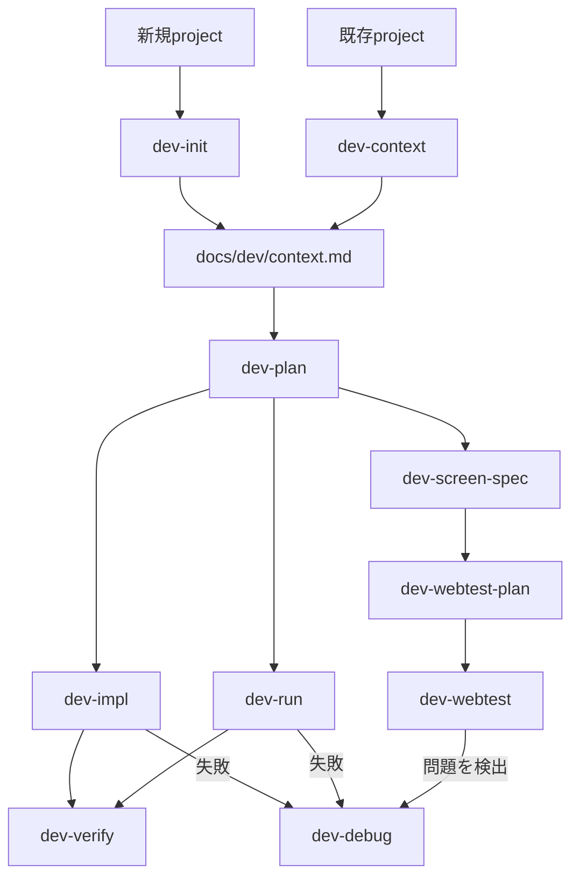

# 外部 skill の使い方

このページでは、`dot_apm/apm.yml` で導入している次の skill の使い方を説明します。

- `crit` / `crit-cli`
- `terminal-browser`
- Tsumiki skills
- Ponytailの6 skill
- `ctx-agent-history-search`
- `resolving-merge-conflicts`
- `grill-me`（内部で `grilling` を使用）
- `diagram-design`
- `find-skills`

## インストール

設定を反映してから APM を実行します。

```bash
chezmoi apply
mise run apm:install
```

`mise run apm:install` は user scope で skill をインストールします。Claude Code では
`~/.claude/skills/`、Codex・GitHub Copilot・Cursor では共通の `~/.agents/skills/` に配置されます。
インストール後は、エージェントを新しいセッションで起動してください。

依存先は再現性のため `dot_apm/apm.yml` で commit SHA に pin しています。更新時は upstream の内容を確認して
`ref` を変更し、もう一度 `chezmoi apply` と `mise run apm:install` を実行します。

## `crit` / `crit-cli`

### 用途

`crit`はcode diff、plan、ローカルHTML、実行中のWeb applicationをbrowser UIで確認し、行や要素へcommentを付けて
エージェントへ戻すreview skillです。`crit-cli`はcommentの作成・返信、reviewの共有、GitHub PRとの同期などを
エージェントがCLIから操作するための補助skillであり、通常は直接起動しません。

### 使い方

`crit`はユーザーが明示的に起動します。Claude Codeでは`/crit`、Codexでは`$crit`を使い、必要に応じてreview対象を
指定します。

```text
/crit docs/plan.md
```

```text
$crit を使って、現在のgit diffをreviewできるようにしてください。
```

devcontainerでは`crit`を起動した後、表示されたhost側URLをbrowserで開きます。commentを送信するとエージェントが
修正し、再reviewできます。CLIの構成、PR commentのpull / push、tool比較は[`docs/crit.md`](crit.md)を参照してください。

## `terminal-browser`

### 用途

terminal pane内に実browserを表示し、エージェントが同じtabに対してsnapshot、click、入力、JavaScript評価を行うskillです。
Web applicationの動作確認、生成したHTMLの可視化、browser上でしか確認できない状態の調査に使用します。

### 使い方

browserで確認したいURLと操作内容を自然言語で伝えます。明示的に指定する場合は、Claude Codeでは
`/terminal-browser`、Codexでは`$terminal-browser`を使用します。

```text
$terminal-browser を使って http://localhost:3000 を開き、login formを操作してerrorがないか確認してください。
```

skillは必要に応じてterminalを分割し、`terminal-browser action`で開いているtabを操作します。認証情報や個人情報を
入力させる場合は、実行する操作と送信先を事前に確認してください。

## Tsumiki skills

Tsumikiは、project初期化、context生成、plan作成、TDD実装、検証、debug、Web test、security checkをつなぐ開発workflowです。
依頼内容に応じて自動選択されますが、Claude Codeでは`/<skill-name>`、Codexでは`$<skill-name>`で明示できます。

| skill                | 用途                                                                                         |
| -------------------- | -------------------------------------------------------------------------------------------- |
| `dev-context`        | projectの技術stack、test framework、規約、architectureを分析し、context fileを生成・更新する |
| `dev-debug`          | test失敗、build・compile error、環境問題を分類し、原因を絞って修正する                       |
| `dev-impl`           | plan内のtaskまたは直接指定した小規模変更を、TDDをguardrailとして実装する                     |
| `dev-init`           | 対話で新規projectの技術stackを決め、承認後にscaffoldとcontextを生成する                      |
| `dev-navigate`       | 目的を聞き取り、使用するTsumiki skillと実行順序を案内する                                    |
| `dev-plan`           | 要件をinterface-firstの設計とtest可能なtaskへ分解し、`docs/dev/plans/`へ保存する             |
| `dev-run`            | plan内のtask範囲を`dev-impl`、`dev-verify`、`dev-debug`のflowで連続実行する                  |
| `dev-screen-spec`    | source codeまたはplanから画面仕様を生成し、既存仕様を差分更新する                            |
| `dev-verify`         | planの完了状態とtest・build・lintの整合性を検証し、reportを出力する                          |
| `dev-webtest-plan`   | dev planや画面仕様からPlaywright用のWeb test planを生成・更新する                            |
| `dev-webtest`        | Playwrightで画面動作、visual、accessibility、responsive、formをtestする                      |
| `ipa-security-check` | IPAの公開資料に基づいてsource codeを静的検査し、出典付きで脆弱性候補を報告する               |
| `ipa-security-guide` | security診断reportを読み、優先順位付きの`dev-debug`依頼リストへ変換する                      |
| `task-breakdown`     | 開発に限らない依頼を、依存関係と完了条件を持つ実行可能なtaskへ構造分解する                   |
| `uat-test-design`    | repositoryを分析し、業務・system・非機能の受入test項目を階層化して生成する                   |

最初にどのskillを使うべきか分からない場合は、次のように`dev-navigate`へ相談します。

```text
/dev-navigate
既存Web applicationへ決済機能を追加したいです。どの順番で進めるべきですか。
```

```text
$dev-plan checkout "決済providerを追加し、失敗時に安全にretryできるようにする"
```

既存projectで一連のworkflowを始める場合は、通常`dev-context` → `dev-plan` → `dev-impl`または`dev-run` →
`dev-verify`の順で使用します。Web UIを含む場合は`dev-webtest-plan`と`dev-webtest`、security確認が必要な場合は
`ipa-security-check`と`ipa-security-guide`を組み合わせます。

## Tsumiki 入門ガイド

### 現行の中心は Dev Skills

Tsumikiの現行workflowはDev Skillsです。従来このページで中心としていたKairo・個別TDD・DIRECT commandは、upstreamで
`tsumiki-legacy` pluginへ分離されたlegacy機能です。新しい開発ではDev Skillsを使用し、Kairoを前提とした
`kairo-requirements` → `kairo-design` → `kairo-tasks`という手順は採用しません。

Dev Skillsは、新規projectの初期化または既存projectの分析から、計画、test-first実装、検証、debug、Web testまでを
次のようにつなぎます。



どこから始めるか判断できない場合は、`dev-navigate`へ目的を伝えます。

```text
/dev-navigate
既存Web applicationへ決済機能を追加したいです。どのskillから始めるべきですか。
```

### 基本workflow

#### 1. Contextを準備する

新規projectでは`dev-init`が技術stackを対話で決定し、承認後にscaffoldします。既存projectでは`dev-context`が技術stack、
test framework、規約、architectureを分析します。どちらも後続skillが共有する`docs/dev/context.md`を生成します。

```text
/dev-init
```

```text
/dev-context
```

#### 2. Planを作る

`dev-plan`はinterface-firstの設計とtest可能なtaskを`docs/dev/plans/<plan-name>/`へ出力します。素早く計画する
Lightweight modeと、EARS要件、user story、受け入れ条件まで作るFull-spec modeがあり、実行中に選択します。

```text
/dev-plan auth "ユーザー認証機能を実装"
```

既存のPRDを入力にすることもできます。

```text
/dev-plan auth ./docs/prd.md
```

#### 3. 実装する

taskを1件ずつ実装する場合は`dev-impl`へplan名とtask IDを渡します。Planを作るほどではない軽微な変更には、修正指示を
直接渡すquick modeを使用できます。どちらもRed → Green → Refactorをguardrailとするtest-first実装です。

```text
/dev-impl auth 001
```

```text
/dev-impl "validation messageを日本語へ変更"
```

複数taskを連続実行する場合は`dev-run`へ対象範囲を渡します。各taskについて`dev-impl`、`dev-verify`、失敗時の
`dev-debug`を組み合わせて実行します。

```text
/dev-run auth 001 005
```

#### 4. 検証・debugする

`dev-verify`はplanのtask完了状態、test、build、lint、file sizeを確認し、
`docs/dev/plans/<plan-name>/reports/`へreportを出力します。

```text
/dev-verify auth
```

失敗の原因を調べて修正する場合は`dev-debug`を使用します。errorの自動検出、error messageの直接指定、Web testで
検出した問題を扱う`webtest` modeに対応します。

```text
/dev-debug "TypeError: Cannot read properties of undefined"
```

### Web UIをtestする

Web UIを含む変更では、画面仕様、Playwright test計画、実行を分離します。

1. `dev-screen-spec`でsource codeまたはplanから`docs/dev/screen-specs/`へ画面仕様を生成・差分更新する。
2. `dev-webtest-plan`でplanと画面仕様からPlaywright用test計画を生成・差分更新する。
3. `dev-webtest`で計画test、monkey test、visual、accessibility、responsive、formを確認する。
4. 問題が見つかった場合は`dev-debug webtest`で修正する。

```text
/dev-screen-spec from-plan auth
/dev-webtest-plan auth
/dev-webtest auth
/dev-debug webtest
```

### その他の現行command

Dev Skills以外にも、目的別のcommandを使用できます。

| カテゴリ            | 主なcommand                                                              | 用途                                                     |
| ------------------- | ------------------------------------------------------------------------ | -------------------------------------------------------- |
| DCS                 | `dcs:feature-rubber-duck`、`dcs:impact-analysis`、`dcs:bug-analysis`など | PRD作成、影響範囲・bug・performance・edge caseなどの分析 |
| utility             | `help`、`orchestrate`、`refine-plan`、`refine-execute`                   | command案内、複雑な依頼の編成、小規模変更の計画と実行    |
| error対応           | `auto-debug`、`build-fix`、`env-fix`、`flaky-fix`、`timeout-fix`         | test、build、環境、flaky test、timeoutの修正             |
| reverse engineering | `rev-tasks`、`rev-design`、`rev-specs`、`rev-requirements`               | 既存codeからtask、設計、test仕様、要件を逆生成           |

このdotfilesではTsumiki commandをRulesync経由でも配布します。Claude Codeでは`/tsumiki-<name>`、Codexでは
`$tsumiki-<name>`として呼び出します。たとえばhelpは`/tsumiki-help`または`$tsumiki-help`です。詳細は
[`docs/rulesync.md`](rulesync.md)を参照してください。

### Legacy commandについて

Kairo、個別TDD、DIRECTが必要な既存workflowでは、upstreamの`tsumiki-legacy` pluginを明示的に導入し、Claude Codeで
`/tsumiki-legacy:<command>`として実行します。たとえばKairoの要件定義は
`/tsumiki-legacy:kairo-requirements`です。現行の`tsumiki` pluginだけを導入した環境では利用できません。

新規作業でKairoの成果物や手順をそのままDev Skillsへ読み替えないでください。Dev Skillsではcontextを
`docs/dev/context.md`、planを`docs/dev/plans/<plan-name>/`で管理し、個別のTDD commandではなく`dev-impl`が
test-first実装を担当します。

## Ponytail skills

Ponytailは、YAGNI、standard library、native platform機能、既存dependencyの順に検討し、要件を満たす最小の実装を
選ぶcoding workflowです。短いcodeを目的化するのではなく、security、accessibility、trust boundaryのvalidation、
data lossを防ぐerror handlingは省略しません。

| skill             | 用途                                                                                |
| ----------------- | ----------------------------------------------------------------------------------- |
| `ponytail`        | 最小の正しい実装を選ぶmode。`lite`、`full`、`ultra`の3段階を切り替えられる          |
| `ponytail-review` | 現在のdiffから過剰なabstraction、不要なdependency、再実装されたstdlibなどを探す     |
| `ponytail-audit`  | repository全体を対象に、削除・単純化できる箇所を優先順位付きで報告する              |
| `ponytail-debt`   | source内の`ponytail:` commentを収集し、意図的に先送りした制約と改善条件を一覧化する |
| `ponytail-gain`   | 公開benchmarkに基づくcode量、cost、処理時間への影響をscoreboardで表示する           |
| `ponytail-help`   | mode、skill、command、無効化方法をquick referenceとして表示する                     |

### 使い方

通常modeは`full`です。Claude Codeでは`/ponytail`、Codexでは`$ponytail`を使い、必要に応じてlevelを指定します。

```text
/ponytail lite
このAPI clientへretryを追加してください。
```

```text
$ponytail ultra を使って、この変更を実現する最小のdiffを作ってください。
```

過剰実装だけをreviewするときは`ponytail-review`、repository全体を調べるときは`ponytail-audit`を使用します。これらは
correctness、security、performanceのreviewを置き換えないため、必要に応じて通常のcode reviewと併用してください。

```text
$ponytail-review を使って、現在のdiffから削除できるabstractionを探してください。
```

Ponytailを止めるときは「stop ponytail」または「normal mode」と伝えます。default levelを変える場合は
`PONYTAIL_DEFAULT_MODE`へ`lite`、`full`、`ultra`、`off`のいずれかを設定します。pluginのalways-on activationには
Node.jsで動くlifecycle hookを使用するため、非対話shellの`PATH`から`node`を実行できる必要があります。

## `ctx-agent-history-search`

### 用途

ローカルに保存された過去のcoding-agent sessionを`ctx` CLIで検索し、以前の判断、試行、失敗理由、関連する会話を
現在の作業前に確認するskillです。同じrepositoryで過去の経緯が役立つ可能性があるときに自動的に使用されます。

### 使い方

初回だけ`ctx setup`でindexを作成します。明示的に使う場合は、Claude Codeでは`/ctx-agent-history-search`、Codexでは
`$ctx-agent-history-search`を指定します。

```text
$ctx-agent-history-search を使って、以前database migrationに失敗したsessionとその原因を調べてください。
```

手動検索では`ctx search "query"`、詳細表示では`ctx show session <session-id>`などを使用します。setup、主要command、
local historyに含まれる秘密情報の注意点は[`docs/ctx.md`](ctx.md)を参照してください。

## `resolving-merge-conflicts`

### 用途

進行中の `git merge` または `git rebase` で発生した conflict を、両方の変更意図を調べながら解消する skill です。
単に片側を採用するのではなく、commit・PR・issue などの一次情報を確認し、可能な限り双方の意図を保ちます。

### 使い方

conflict が発生した状態で、エージェントに自然言語で依頼します。明示的に指定する場合は、Claude Code では
`/resolving-merge-conflicts`、Codex では `$resolving-merge-conflicts` を使用します。

```text
/resolving-merge-conflicts
現在の rebase conflict を、各 commit の意図を確認して解消してください。
```

```text
$resolving-merge-conflicts を使って、この merge conflict を解消してください。
```

skill は次の順に作業します。

1. merge/rebase の状態、履歴、conflict 対象を確認する。
2. 各変更の commit・PR・issue を調べ、意図を特定する。
3. conflict を hunk 単位で解消する。
4. リポジトリの typecheck・test・format などを実行する。
5. ファイルを stage し、merge commit または `git rebase --continue` まで完了する。

> [!IMPORTANT]
> この skill は進行中の merge/rebase を `--abort` せず、最後まで完了させる方針です。中断したい場合は、実行前に
> その旨を明示してください。また、作業ツリーに退避していない変更がないか事前に確認してください。

## `grill-me`

### 用途

計画、設計、意思決定を実行に移す前に、未決定事項や暗黙の前提を質問によって洗い出す skill です。質問を
decision tree として扱い、前提が確定した時点で回答可能になる質問を round ごとに提示します。

`grill-me` はユーザーが明示的に起動する skill です。質問処理の本体である `grilling` も APM で一緒に
インストールされます。

### 使い方

Claude Code では `/grill-me`、Codex では `$grill-me` に続けて検討対象を渡します。

```text
/grill-me
社内 API を外部パートナーへ公開する計画について、実装前に不足している判断を洗い出してください。
```

```text
$grill-me を使って、新しい CLI の配布方法を固めたいです。
```

各 round では複数の質問と推奨回答が提示されます。質問へ回答すると、その回答に依存する次の質問が提示されます。
すべての branch が解決すると interview は終了しますが、合意内容を実装へ移すのはユーザーが明示的に確認した後です。

効果的に使うため、最初の依頼には次を含めます。

- 達成したい結果と対象ユーザー
- 既に決まっていること
- 変更できない制約（期限、互換性、予算など）
- 特に不安な判断

## `diagram-design`

### 用途

architecture、flowchart、sequence、ER、timeline、swimlane、quadrant、Gantt などの図を、inline SVG/CSS を含む
self-contained HTML として生成する skill です。文章や表より図の方が理解しやすい情報に使用します。

### 初回セットアップ

最初の図を作るとき、skill は同梱の `references/style-guide.md` がデフォルトのままか確認します。デフォルトの場合は、
次のいずれかを選択します。

1. Web サイトの URL から色と font を抽出する。
2. インストール済み skill の design token を参照する。
3. ローカルの design system directory から抽出する。
4. token を手動で渡す。
5. デフォルトテーマをそのまま使う。

APM の再インストールや更新では配布先が再生成される可能性があります。ブランド設定を継続的に管理したい場合は、
upstream skill を直接編集せず、生成時に URL・design system・token を指定してください。

### 使い方

作りたい図、含める要素、要素間の関係、出力先を自然言語で依頼します。skill は依頼内容から図の種類を選択します。
明示的に指定する場合は、Claude Code では `/diagram-design`、Codex では `$diagram-design` を使用します。

```text
/diagram-design
Web、API、PostgreSQL、Redis、外部決済サービスを含む architecture diagram を作り、
docs/architecture.html に保存してください。主要な request と data flow も表示してください。
```

```text
$diagram-design を使って、OAuth authorization code flow の sequence diagram を
docs/oauth-sequence.html に作成してください。
```

出力は build step や外部画像を必要としない HTML なので、browser で直接確認できます。

```bash
open docs/architecture.html # macOS
xdg-open docs/architecture.html # Linux
```

PNG または SVG が必要な場合は、生成後に自然言語で対象ファイルと形式を指定します。

```text
docs/architecture.html の図を SVG と PNG に export してください。
```

SVG は standalone file として生成されます。PNG export には Python 版 Playwright と Chromium が必要です。
未導入の場合は、export を依頼する前に次のコマンドを実行します。

```bash
pip install playwright
playwright install chromium
```

SVG は Google Fonts を外部参照するため、font を取得しない offline viewer などでは代替 font で表示される可能性が
あります。pixel-perfect な持ち運びが必要な場合は PNG を使用してください。diagram 生成時は、要素を詰め込みすぎず、
複雑な場合は overview と detail に分割してください。

## `find-skills`

### 用途

実現したい作業に利用できる既存のagent skillを検索し、候補の品質を確認して提案するskillです。「この作業に使える
skillはあるか」「エージェントへ特定分野の能力を追加したい」といった依頼で使用します。

検索結果をそのまま勧めるのではなく、install数、配布元の信頼性、GitHub starsなどを確認してから候補を提示します。
適切なskillが見つからなかった場合は、通常のエージェント機能で作業を続けるか、独自skillを作る方法を提案します。

### 使い方

skillは該当する依頼から自動的に選択されます。明示的に指定する場合は、Claude Codeでは`/find-skills`、Codexでは
`$find-skills`を使用し、探したい分野と具体的な作業を伝えます。

```text
/find-skills
Playwrightを使ったE2E testの設計と実装を支援するskillを探してください。
```

```text
$find-skills を使って、Pull Requestのreviewに利用できるskillを探してください。
```

skillは最初に[skills.sh](https://skills.sh/)のleaderboardを確認し、必要に応じてSkills CLIで検索します。

```bash
npx skills find "react performance"
npx skills find "pr review"
npx skills find testing --owner vercel-labs
```

候補が見つかると、用途、install数、配布元、install command、詳細ページが提示されます。提示されたskillをこの
dotfilesで継続管理する場合は、提案された`npx skills add`を直接実行するのではなく、upstreamを確認して
`dot_apm/apm.yml`へcommit SHAまたはrelease tagでpinし、APMでインストールしてください。
