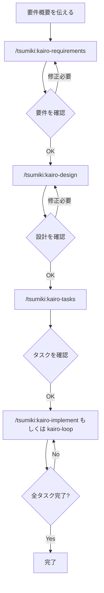

# 外部 skill の使い方

このページでは、`dot_apm/apm.yml` で導入している次の skill の使い方を説明します。

- `crit` / `crit-cli`
- `difit` / `difit-review`
- `terminal-browser`
- Tsumikiの14 skill
- Ponytailの6 skill
- `ctx-agent-history-search`
- `resolving-merge-conflicts`
- `grill-me`（内部で `grilling` を使用）
- `diagram-design`
- `find-skills`

## インストール

設定を反映してから APM を実行します。

```bash
chezmoi apply
mise run apm:install
```

`mise run apm:install` は user scope で skill をインストールします。Claude Code では
`~/.claude/skills/`、Codex・GitHub Copilot・Cursor では共通の `~/.agents/skills/` に配置されます。
インストール後は、エージェントを新しいセッションで起動してください。

依存先は再現性のため `dot_apm/apm.yml` で commit SHA に pin しています。更新時は upstream の内容を確認して
`ref` を変更し、もう一度 `chezmoi apply` と `mise run apm:install` を実行します。

## `crit` / `crit-cli`

### 用途

`crit`はcode diff、plan、ローカルHTML、実行中のWeb applicationをbrowser UIで確認し、行や要素へcommentを付けて
エージェントへ戻すreview skillです。`crit-cli`はcommentの作成・返信、reviewの共有、GitHub PRとの同期などを
エージェントがCLIから操作するための補助skillであり、通常は直接起動しません。

### 使い方

`crit`はユーザーが明示的に起動します。Claude Codeでは`/crit`、Codexでは`$crit`を使い、必要に応じてreview対象を
指定します。

```text
/crit docs/plan.md
```

```text
$crit を使って、現在のgit diffをreviewできるようにしてください。
```

devcontainerでは`crit`を起動した後、表示されたhost側URLをbrowserで開きます。commentを送信するとエージェントが
修正し、再reviewできます。CLIの構成やhost portの確認方法は[`docs/crit.md`](crit.md)を参照してください。

## `difit` / `difit-review`

`difit`は変更後にhuman reviewを依頼するskillです。browserで入力したcommentはserver終了時に標準出力へ返るため、
clipboardへのprompt copyなしで、起動元のagentが指摘を受け取り修正を続けます。`difit-review`はagent側のreview結果を
commentとしてUIへ事前投入し、人間へ提示するskillです。

```text
$difit を使って、現在の未コミット変更をレビューできるようにしてください。
```

devcontainerではagentが表示するhost側URLを開き、commentを追加してreviewを終了します。foreground processを待っていた
agentがcommentを受け取ります。構成とcritとの違いは[`docs/difit.md`](difit.md)を参照してください。

## `terminal-browser`

### 用途

terminal pane内に実browserを表示し、エージェントが同じtabに対してsnapshot、click、入力、JavaScript評価を行うskillです。
Web applicationの動作確認、生成したHTMLの可視化、browser上でしか確認できない状態の調査に使用します。

### 使い方

browserで確認したいURLと操作内容を自然言語で伝えます。明示的に指定する場合は、Claude Codeでは
`/terminal-browser`、Codexでは`$terminal-browser`を使用します。

```text
$terminal-browser を使って http://localhost:3000 を開き、login formを操作してerrorがないか確認してください。
```

skillは必要に応じてterminalを分割し、`terminal-browser action`で開いているtabを操作します。認証情報や個人情報を
入力させる場合は、実行する操作と送信先を事前に確認してください。

## Tsumiki skills

Tsumikiは、project初期化、context生成、plan作成、TDD実装、検証、debug、Web test、security checkをつなぐ開発workflowです。
依頼内容に応じて自動選択されますが、Claude Codeでは`/<skill-name>`、Codexでは`$<skill-name>`で明示できます。

| skill                | 用途                                                                                         |
| -------------------- | -------------------------------------------------------------------------------------------- |
| `dev-context`        | projectの技術stack、test framework、規約、architectureを分析し、context fileを生成・更新する |
| `dev-debug`          | test失敗、build・compile error、環境問題を分類し、原因を絞って修正する                       |
| `dev-impl`           | plan内のtaskまたは直接指定した小規模変更を、TDDをguardrailとして実装する                     |
| `dev-init`           | 対話で新規projectの技術stackを決め、承認後にscaffoldとcontextを生成する                      |
| `dev-navigate`       | 目的を聞き取り、使用するTsumiki skillと実行順序を案内する                                    |
| `dev-plan`           | 要件をinterface-firstの設計とtest可能なtaskへ分解し、`docs/dev/plans/`へ保存する             |
| `dev-run`            | plan内のtask範囲を`dev-impl`、`dev-verify`、`dev-debug`のflowで連続実行する                  |
| `dev-screen-spec`    | source codeまたはplanから画面仕様を生成し、既存仕様を差分更新する                            |
| `dev-verify`         | planの完了状態とtest・build・lintの整合性を検証し、reportを出力する                          |
| `dev-webtest-plan`   | dev planや画面仕様からPlaywright用のWeb test planを生成・更新する                            |
| `dev-webtest`        | Playwrightで画面動作、visual、accessibility、responsive、formをtestする                      |
| `ipa-security-check` | IPAの公開資料に基づいてsource codeを静的検査し、出典付きで脆弱性候補を報告する               |
| `ipa-security-guide` | security診断reportを読み、優先順位付きの`dev-debug`依頼リストへ変換する                      |
| `kairo-implement`    | 分割済みtaskを指定順に実装し、TDD commandを使って完了まで検証する                            |

最初にどのskillを使うべきか分からない場合は、次のように`dev-navigate`へ相談します。

```text
/dev-navigate
既存Web applicationへ決済機能を追加したいです。どの順番で進めるべきですか。
```

```text
$dev-plan checkout "決済providerを追加し、失敗時に安全にretryできるようにする"
```

既存projectで一連のworkflowを始める場合は、通常`dev-context` → `dev-plan` → `dev-impl`または`dev-run` →
`dev-verify`の順で使用します。Web UIを含む場合は`dev-webtest-plan`と`dev-webtest`、security確認が必要な場合は
`ipa-security-check`と`ipa-security-guide`を組み合わせます。

## tsumiki 入門ガイド

### 1. tsumikiとは何か

tsumikiは「**要件定義 → 設計 → タスク分割 → 実装（TDD）**」という開発プロセスを、Claude Codeのスラッシュコマンド／スキルとして一気通貫でサポートするフレームワークです。

大きく分けて以下のコマンド群があります。

| カテゴリ                     | 何をするか                                              | 本プロジェクトで使うか               |
| ---------------------------- | ------------------------------------------------------- | ------------------------------------ |
| **Kairo**                    | 要件定義〜実装までの包括的フロー                        | ◎ メインで使用                       |
| **TDD**                      | Red/Green/Refactorの個別実行（Kairoの内部でも使われる） | △ 必要に応じて個別実行               |
| **Dev Skills**               | コンテキスト分析・計画・実装・検証の統合ワークフロー    | △ 代替案として利用可                 |
| **DCS**                      | 既存コードの分析・調査・PRD作成支援                     | △ 途中の調査で利用可                 |
| **ユーティリティ**           | ヘルプ・自動デバッグ・小規模修正など                    | ○ 困ったときに利用                   |
| **リバースエンジニアリング** | 既存コードから設計書・要件定義書を逆生成                | – 今回はゼロからの開発なので基本不要 |

ポイントは、**各ステップの成果物がすべて `docs/` 配下にMarkdown等のドキュメントとして残る**ことです。これは今回の課題が必須としている「Design Doc」や「判断理由の記録」とも相性が良い仕組みです。

---

### 2. 全体のワークフロー（Kairo）

tsumikiのメインフローは次の5ステップです。



**重要な考え方**: 各ステップの後には必ず人間（自分）が生成物をレビューし、必要なら修正を指示してから次のステップに進みます。生成AIに丸投げするのではなく、「AIの提案を検証・レビューする過程」自体が今回の課題で評価されるポイントでもあります。

---

### 3. 各コマンドの詳細

#### 3-1. `/tsumiki:init-tech-stack` — 技術スタックの決定

プロジェクトで使うフレームワーク・ライブラリを対話的に決めます。

- 生成物: `docs/tech-stack.md`
- 今回は非機能要件で「フロントエンド: TypeScript + React」「バックエンド: Go」と指定されているため、その制約を踏まえた選定を行うことになります（React内でのラッパーフレームワークやUIライブラリ、Goでのフレームワーク・APIスキーマ形式など、指定がない部分をここで決定していきます）。

#### 3-2. `/tsumiki:kairo-requirements` — 要件定義

要件の概要を渡すと、EARS記法（Easy Approach to Requirements Syntax）で詳細な要件定義書を作ってくれます。

```
/tsumiki:kairo-requirements 要件概要
```

- 生成物: `docs/spec/{要件名}-requirements.md`
- 含まれる内容: ユーザーストーリー、EARS記法の詳細要件、エッジケース、受け入れ基準
- 課題側の「Design Doc に要件の整理（自分で補った要件を含む）を書く」という要求と直結する部分です。README.mdの機能要件（ツイート・フォロー・タイムライン）や非機能要件をここでインプットします。

#### 3-3. `/tsumiki:kairo-design` — 設計

要件を承認した後に実行します（省略しても直前の要件定義を引き継いで実行可能）。

- 生成物: `docs/design/{要件名}/` 配下
  - アーキテクチャ設計書
  - データフロー図（Mermaid）
  - TypeScriptインターフェース定義
  - データベーススキーマ
  - APIエンドポイント仕様
- **注意点**: 課題が求める「Design Doc」には「検討した選択肢とトレードオフ」「最終的に選んだ方針とその理由」という比較検討のセクションが必須です。`kairo-design` はそのまま「決定した設計」を出力する傾向があるため、この比較検討部分は生成後に自分で加筆するか、設計を依頼する際のプロンプトで「複数の選択肢とトレードオフも明記してほしい」と明示的に指示するのがおすすめです。

#### 3-4. `/tsumiki:kairo-tasks` — タスク分割

設計を確認した後に実行します。

- 生成物: `docs/tasks/{要件名}/overview.md`、`docs/tasks/{要件名}/TASK-XXXX.md`
- 依存関係を考慮した実装順序、各タスクのテスト要件・UI/UX要件まで含めて分割してくれます。
- `/tsumiki:kairo-task-verify`（タスク内容の確認用コマンド）を実行してから実装に進むと安全です。

#### 3-5. 実装コマンド

タスクができたら実装に入ります。2つのやり方があります。

```bash
# 全タスクを順番に実装
/tsumiki:kairo-implement

# 特定タスクだけ実装（タスクファイル名 TASK番号 を指定）
/tsumiki:kairo-implement タスクファイル名 TASK番号

# タスク範囲を指定して自動連続実装（長時間実行・compact対応）
/tsumiki:kairo-loop
```

内部的には各タスクごとに以下のTDDサイクルが自動で回ります。

1. `tdd-requirements`（TDD要件定義）
2. `tdd-testcases`（テストケース作成）
3. `tdd-red`（失敗するテストを書く）
4. `tdd-green`（テストを通す最小実装）
5. `tdd-refactor`（リファクタリング）
6. `tdd-verify-complete`（完了確認）

このサイクルを個別に手動で回したい場合は `/tsumiki:tdd-requirements` 〜 `/tsumiki:tdd-verify-complete` を1つずつ呼び出すこともできます。

---

### 4. 生成物が置かれるディレクトリ構成

```
./
├── docs/
│   ├── tech-stack.md        # 技術スタック選定
│   ├── spec/{要件名}/        # 要件定義書（requirements.md 等）
│   ├── design/{要件名}/      # 設計書（architecture.md, api-endpoints.md, database-schema.sql 等）
│   ├── tasks/{要件名}/       # タスク一覧（overview.md, TASK-XXXX.md）
│   └── implements/{要件名}/{タスクID}/  # 実装に関する記録
├── frontend/                # フロントエンド（TypeScript + React）
├── backend/                 # バックエンド（Go）
└── database/                # DB関連
```

プロジェクト固有のルールを追加したい場合は `docs/rule/{種類1}/{種類2}/*.md` にMarkdownを置くと、対応するコマンド実行時に自動で読み込まれます（例: `docs/rule/kairo/requirements/` は `kairo-requirements` 実行時のみ読み込まれる）。

---

### 5. 困ったときは

```bash
# コマンド一覧・使い方を表示
/tsumiki:help

# 特定コマンドの詳細ヘルプ
/tsumiki:help kairo-requirements

# 「〜が分からない」で検索
/tsumiki:help テストが失敗して原因がわからない
```

その他、テストやビルドで詰まった場合は `/tsumiki:auto-debug`（テストエラー自動デバッグ）、`/tsumiki:build-fix`（ビルドエラー修正）なども用意されています。

---

### 6. 本プロジェクト（ENG-1100課題）での想定進行イメージ

`ENG-1100/README.md` の要件（ツイート・フォロー・タイムライン、TypeScript+React／Go、Design Doc必須）を踏まえると、次の順序で進めるのが自然です。

1. `/tsumiki:init-tech-stack` — React側のフレームワークやUIライブラリ、Go側のWebフレームワークやAPIスキーマ形式（OpenAPI等）を決定
2. `/tsumiki:kairo-requirements` — 機能要件・非機能要件・自分で補った要件をEARS記法で整理
3. `/tsumiki:kairo-design` — アーキテクチャ、データフロー、API仕様、DBスキーマを設計。**比較検討したトレードオフと決定理由は別途加筆**して課題の「Design Doc」要件を満たす
4. `/tsumiki:kairo-tasks` → `/tsumiki:kairo-task-verify` — 実装タスクへ分割・確認
5. `/tsumiki:kairo-implement` または `/tsumiki:kairo-loop` — TDDサイクルで実装を進行

各ステップの成果物は必ず内容を読んでレビューし、必要な修正指示を出してから次に進むことをおすすめします（AIに任せた部分と自分で判断した部分を分けて記録する、という課題の評価観点にも合致します）。

## Ponytail skills

Ponytailは、YAGNI、standard library、native platform機能、既存dependencyの順に検討し、要件を満たす最小の実装を
選ぶcoding workflowです。短いcodeを目的化するのではなく、security、accessibility、trust boundaryのvalidation、
data lossを防ぐerror handlingは省略しません。

| skill             | 用途                                                                                |
| ----------------- | ----------------------------------------------------------------------------------- |
| `ponytail`        | 最小の正しい実装を選ぶmode。`lite`、`full`、`ultra`の3段階を切り替えられる          |
| `ponytail-review` | 現在のdiffから過剰なabstraction、不要なdependency、再実装されたstdlibなどを探す     |
| `ponytail-audit`  | repository全体を対象に、削除・単純化できる箇所を優先順位付きで報告する              |
| `ponytail-debt`   | source内の`ponytail:` commentを収集し、意図的に先送りした制約と改善条件を一覧化する |
| `ponytail-gain`   | 公開benchmarkに基づくcode量、cost、処理時間への影響をscoreboardで表示する           |
| `ponytail-help`   | mode、skill、command、無効化方法をquick referenceとして表示する                     |

### 使い方

通常modeは`full`です。Claude Codeでは`/ponytail`、Codexでは`$ponytail`を使い、必要に応じてlevelを指定します。

```text
/ponytail lite
このAPI clientへretryを追加してください。
```

```text
$ponytail ultra を使って、この変更を実現する最小のdiffを作ってください。
```

過剰実装だけをreviewするときは`ponytail-review`、repository全体を調べるときは`ponytail-audit`を使用します。これらは
correctness、security、performanceのreviewを置き換えないため、必要に応じて通常のcode reviewと併用してください。

```text
$ponytail-review を使って、現在のdiffから削除できるabstractionを探してください。
```

Ponytailを止めるときは「stop ponytail」または「normal mode」と伝えます。default levelを変える場合は
`PONYTAIL_DEFAULT_MODE`へ`lite`、`full`、`ultra`、`off`のいずれかを設定します。pluginのalways-on activationには
Node.jsで動くlifecycle hookを使用するため、非対話shellの`PATH`から`node`を実行できる必要があります。

## `ctx-agent-history-search`

### 用途

ローカルに保存された過去のcoding-agent sessionを`ctx` CLIで検索し、以前の判断、試行、失敗理由、関連する会話を
現在の作業前に確認するskillです。同じrepositoryで過去の経緯が役立つ可能性があるときに自動的に使用されます。

### 使い方

初回だけ`ctx setup`でindexを作成します。明示的に使う場合は、Claude Codeでは`/ctx-agent-history-search`、Codexでは
`$ctx-agent-history-search`を指定します。

```text
$ctx-agent-history-search を使って、以前database migrationに失敗したsessionとその原因を調べてください。
```

手動検索では`ctx search "query"`、詳細表示では`ctx show session <session-id>`などを使用します。setup、主要command、
local historyに含まれる秘密情報の注意点は[`docs/ctx.md`](ctx.md)を参照してください。

## `resolving-merge-conflicts`

### 用途

進行中の `git merge` または `git rebase` で発生した conflict を、両方の変更意図を調べながら解消する skill です。
単に片側を採用するのではなく、commit・PR・issue などの一次情報を確認し、可能な限り双方の意図を保ちます。

### 使い方

conflict が発生した状態で、エージェントに自然言語で依頼します。明示的に指定する場合は、Claude Code では
`/resolving-merge-conflicts`、Codex では `$resolving-merge-conflicts` を使用します。

```text
/resolving-merge-conflicts
現在の rebase conflict を、各 commit の意図を確認して解消してください。
```

```text
$resolving-merge-conflicts を使って、この merge conflict を解消してください。
```

skill は次の順に作業します。

1. merge/rebase の状態、履歴、conflict 対象を確認する。
2. 各変更の commit・PR・issue を調べ、意図を特定する。
3. conflict を hunk 単位で解消する。
4. リポジトリの typecheck・test・format などを実行する。
5. ファイルを stage し、merge commit または `git rebase --continue` まで完了する。

> [!IMPORTANT]
> この skill は進行中の merge/rebase を `--abort` せず、最後まで完了させる方針です。中断したい場合は、実行前に
> その旨を明示してください。また、作業ツリーに退避していない変更がないか事前に確認してください。

## `grill-me`

### 用途

計画、設計、意思決定を実行に移す前に、未決定事項や暗黙の前提を質問によって洗い出す skill です。質問を
decision tree として扱い、前提が確定した時点で回答可能になる質問を round ごとに提示します。

`grill-me` はユーザーが明示的に起動する skill です。質問処理の本体である `grilling` も APM で一緒に
インストールされます。

### 使い方

Claude Code では `/grill-me`、Codex では `$grill-me` に続けて検討対象を渡します。

```text
/grill-me
社内 API を外部パートナーへ公開する計画について、実装前に不足している判断を洗い出してください。
```

```text
$grill-me を使って、新しい CLI の配布方法を固めたいです。
```

各 round では複数の質問と推奨回答が提示されます。質問へ回答すると、その回答に依存する次の質問が提示されます。
すべての branch が解決すると interview は終了しますが、合意内容を実装へ移すのはユーザーが明示的に確認した後です。

効果的に使うため、最初の依頼には次を含めます。

- 達成したい結果と対象ユーザー
- 既に決まっていること
- 変更できない制約（期限、互換性、予算など）
- 特に不安な判断

## `diagram-design`

### 用途

architecture、flowchart、sequence、ER、timeline、swimlane、quadrant、Gantt などの図を、inline SVG/CSS を含む
self-contained HTML として生成する skill です。文章や表より図の方が理解しやすい情報に使用します。

### 初回セットアップ

最初の図を作るとき、skill は同梱の `references/style-guide.md` がデフォルトのままか確認します。デフォルトの場合は、
次のいずれかを選択します。

1. Web サイトの URL から色と font を抽出する。
2. インストール済み skill の design token を参照する。
3. ローカルの design system directory から抽出する。
4. token を手動で渡す。
5. デフォルトテーマをそのまま使う。

APM の再インストールや更新では配布先が再生成される可能性があります。ブランド設定を継続的に管理したい場合は、
upstream skill を直接編集せず、生成時に URL・design system・token を指定してください。

### 使い方

作りたい図、含める要素、要素間の関係、出力先を自然言語で依頼します。skill は依頼内容から図の種類を選択します。
明示的に指定する場合は、Claude Code では `/diagram-design`、Codex では `$diagram-design` を使用します。

```text
/diagram-design
Web、API、PostgreSQL、Redis、外部決済サービスを含む architecture diagram を作り、
docs/architecture.html に保存してください。主要な request と data flow も表示してください。
```

```text
$diagram-design を使って、OAuth authorization code flow の sequence diagram を
docs/oauth-sequence.html に作成してください。
```

出力は build step や外部画像を必要としない HTML なので、browser で直接確認できます。

```bash
open docs/architecture.html # macOS
xdg-open docs/architecture.html # Linux
```

PNG または SVG が必要な場合は、生成後に自然言語で対象ファイルと形式を指定します。

```text
docs/architecture.html の図を SVG と PNG に export してください。
```

SVG は standalone file として生成されます。PNG export には Python 版 Playwright と Chromium が必要です。
未導入の場合は、export を依頼する前に次のコマンドを実行します。

```bash
pip install playwright
playwright install chromium
```

SVG は Google Fonts を外部参照するため、font を取得しない offline viewer などでは代替 font で表示される可能性が
あります。pixel-perfect な持ち運びが必要な場合は PNG を使用してください。diagram 生成時は、要素を詰め込みすぎず、
複雑な場合は overview と detail に分割してください。

## `find-skills`

### 用途

実現したい作業に利用できる既存のagent skillを検索し、候補の品質を確認して提案するskillです。「この作業に使える
skillはあるか」「エージェントへ特定分野の能力を追加したい」といった依頼で使用します。

検索結果をそのまま勧めるのではなく、install数、配布元の信頼性、GitHub starsなどを確認してから候補を提示します。
適切なskillが見つからなかった場合は、通常のエージェント機能で作業を続けるか、独自skillを作る方法を提案します。

### 使い方

skillは該当する依頼から自動的に選択されます。明示的に指定する場合は、Claude Codeでは`/find-skills`、Codexでは
`$find-skills`を使用し、探したい分野と具体的な作業を伝えます。

```text
/find-skills
Playwrightを使ったE2E testの設計と実装を支援するskillを探してください。
```

```text
$find-skills を使って、Pull Requestのreviewに利用できるskillを探してください。
```

skillは最初に[skills.sh](https://skills.sh/)のleaderboardを確認し、必要に応じてSkills CLIで検索します。

```bash
npx skills find "react performance"
npx skills find "pr review"
npx skills find testing --owner vercel-labs
```

候補が見つかると、用途、install数、配布元、install command、詳細ページが提示されます。提示されたskillをこの
dotfilesで継続管理する場合は、提案された`npx skills add`を直接実行するのではなく、upstreamを確認して
`dot_apm/apm.yml`へcommit SHAまたはrelease tagでpinし、APMでインストールしてください。
