# 仕様駆動開発 workflow の選定と運用

この文書は、要件の壁打ちから画面設計、task分解、AI実装、完了監査までをつなぐための比較・運用ガイドです。
結論として、**新規機能では Spec Kit を主軸に小さく試し、`grill-me` と `wireframe-spec` を前段へ、
`speckit.analyze` と `speckit.converge` を実装の前後へ置く**構成を第一候補にします。TsumikiはTDDを強制したい案件、
OpenSpecは既存projectで軽量にspecを継続管理したい案件、BMad Methodはproduct・UX・architectureの専門roleまで含む
大規模な企画に向きます。

> [!IMPORTANT]
> どのframeworkも「全taskを自動実装した」と表示しただけでは完了の証明になりません。要件IDとtask・testのcoverage、
> 実装後の差分監査を独立したgateにします。

## 比較対象

公式repositoryと同梱workflowを基準に比較します。GitHub star数のような変動値ではなく、成果物、検査gate、導入単位を
判断材料にしています。

| 候補                                                        | 要件 → task → 実装                                     | 仕様を詰める仕組み                            | 実装漏れへの防御                                                                             | 向く状況 / 注意点                                                                                                     |
| ----------------------------------------------------------- | ------------------------------------------------------ | --------------------------------------------- | -------------------------------------------------------------------------------------------- | --------------------------------------------------------------------------------------------------------------------- |
| [GitHub Spec Kit](https://github.com/github/spec-kit)       | `specify` → `plan` → `tasks` → `implement`             | `constitution`、`clarify`、要件checklist      | 実装前の`analyze`がspec・plan・tasksのcoverageを検査し、実装後の`converge`が残差をtaskへ戻す | **第一候補**。phase gateと文書量は多いが、漏れ対策をworkflowとして説明しやすい                                        |
| [Tsumiki](https://github.com/classmethod/tsumiki)           | Kairo / `dev-plan` → `dev-run`、taskごとのTDD          | EARS要件、設計、screen spec                   | `task-breakdown`、TDD、`dev-verify`、UAT / Web test                                          | test-first実装を重視する時。現在の不満が「task自体の欠落」なら、同じ実装loopの再実行だけでなく外部coverage gateを足す |
| [OpenSpec](https://github.com/Fission-AI/OpenSpec)          | proposal・spec・design・tasks → `apply` → archive      | `explore`で検討し、artifactを任意順で反復可能 | `verify`でartifactと実装の一致を確認                                                         | 軽量でbrownfieldや小さな変更に導入しやすい。厳密なphase gateより反復性を優先                                          |
| [BMad Method](https://github.com/bmad-code-org/BMAD-METHOD) | product brief / PRD → UX・architecture → stories → dev | Analyst、PM、UX、Architect等の専門workflow    | story単位のreviewとtest workflow                                                             | 大きなproduct discoveryや複数専門観点が必要な時。小機能には役割・成果物が過剰になりやすい                             |

### 選定方針

1. まず実案件1機能で**Spec KitとTsumikiを同じ評価表でpilot**する。
2. task実装漏れを最重要課題とするため、`analyze`（事前coverage）と`converge`（事後残差）の両方を持つSpec Kitを
   暫定の第一候補にする。
3. TDDの細かさが最優先、またはTsumiki固有のWeb test / IPA security flowが必要ならTsumikiを残す。
4. frameworkを混ぜて同じartifactを二重生成しない。主軸は1つにし、`grill-me`とdesign skillは補助として組み込む。

pilotでは、(a)要件からtaskへのcoverage、(b)受け入れ条件のtest化率、(c)実装後に見つかった漏れ数、
(d)人間のreview時間、(e)生成文書の保守時間を記録します。2〜3機能で比較しないと、機能規模やmodel出力の偶然を
frameworkの差と誤認しやすいためです。

## 推奨 workflow

```mermaid
flowchart LR
    A[依頼・制約] --> B[grill-me]
    B --> C[合意した要件 draft]
    C --> D[Spec Kit specify / clarify]
    D --> E[画面・状態一覧]
    E --> F[wireframe-spec]
    F --> G[人間がwireframe承認]
    G --> H[Spec Kit plan / tasks]
    H --> I[analyze: coverage gate]
    I -->|指摘あり| D
    I -->|合格| J[implement]
    J --> K[test・build・画面確認]
    K --> L[converge: 実装残差監査]
    L -->|残taskあり| J
    L -->|残差なし| M[PR review]
```



### 0. projectの原則を一度だけ決める

Spec Kitをprojectへ導入し、`speckit.constitution`でtest、accessibility、security、browser support、
「要件IDをtaskとtestから参照する」ことを非交渉の原則にします。CLIやtemplateはproject側に生成されるため、
このdotfilesのAPM依存としては導入せず、[Spec Kit公式手順](https://github.com/github/spec-kit#-get-started)で
対象repositoryごとに初期化します。

### 1. `grill-me`で問題と判断を固める

実装案ではなく、対象user、解決したいproblem、scope外、成功指標、権限、data、failure、運用、移行、互換性の順に
decision treeを掘ります。

```text
$grill-me を使って次の機能を仕様化する前に壁打ちしてください。
目的: <達成したい結果>
対象user: <user>
既決事項: <変更しない判断>
制約: <期限・予算・互換性>
不安: <特に反証してほしい前提>
質問が尽きたら、決定事項・未決事項・scope外・riskをまとめ、私の承認を待ってください。
```

`grill-me`は意思決定の探索に使い、最終的な要件台帳にはしません。終了後に合意事項をspecへ転記し、未決事項を
勝手にdefault値で埋めず明示的に残します。

### 2. specを作り、曖昧さを除く

`speckit.specify`でuser story、機能要件、成功条件、edge caseへ整形し、`speckit.clarify`を実行します。
各機能要件に`FR-###`、実装可能な非機能要件に`NFR-###`を付け、受け入れ条件を観測可能なGiven / When / Thenで
記述します。文言が「高速」「直感的」「適切に」のままなら先へ進みません。

### 3. `wireframe-spec`で画面を固める

画面ごとにhappy pathだけでなく、empty、loading、partial、error、permission denied、offline、長文、mobileを対象にします。
`wireframe-spec`は画像生成skillではなく、content priority、配置、interaction、responsive、accessibilityを含む**注釈付き
layout仕様**です。必要ならその仕様からHTML prototypeを実装させ、browser screenshotを人間がreviewします。

```text
$wireframe-spec を使い、承認済みspecのFR-001〜FR-008に対応するannotated low-fi wireframeを作ってください。
desktopとmobile、empty/loading/error/permission deniedを含め、各要素へ要件ID、interaction、data source、
keyboard操作、focus順を注記し、docs/design/<feature>/wireframe.mdへ保存してください。
```

reviewで画面要件が変わったら、先にspecへ反映してからwireframeを更新します。wireframeだけに存在する仕様を作らないことが
traceabilityを保つ鍵です。視覚的なflow図が必要なら`diagram-design`、実装画面のコメントloopには`crit`を併用できます。

### 4. planとtaskへ分解し、実装前にcoverageを検査する

承認済みspecとwireframeを入力として`plan`、`tasks`を実行します。各taskには対象要件ID、変更予定file、完了条件、test、
依存taskを必須とします。UI taskには全状態とresponsive / accessibility確認を列挙します。

次に`analyze`を実行し、少なくとも次が0件になるまで実装しません。

- taskへmapされない`FR` / `NFR`と受け入れ条件
- 要件へmapされないtask（scope creep）
- test taskのない振る舞い、error path、migration / rollback
- spec・plan・wireframe間の用語や状態の不一致
- 依存関係が欠落したtask

### 5. AI実装は小さいbatchと独立検証で進める

`implement`を全件一括で信用せず、依存関係に沿った小さいbatchで実行します。各batchでtest、typecheck、lintを通し、
task checkboxを更新する前にdiffと受け入れ条件を照合します。画面は実browserでdesktop / mobileと主要状態を撮影し、
wireframeとの差分をreviewします。

### 6. `converge`とPR reviewで完了を証明する

全task実装後に`converge`でcodebaseをspec・plan・tasksと再照合し、残差を新しいtaskとして戻します。その後、要件IDごとの
最終traceability表（要件 → task → code / test → 結果）をPRへ載せます。「agentが完了と言った」ではなく、coverage表、
自動test、画面確認、review指摘0件を終了条件にします。

## 最小成果物とgate

| 段階   | 必須成果物                                | 次へ進む条件                                   |
| ------ | ----------------------------------------- | ---------------------------------------------- |
| 壁打ち | 決定事項、未決事項、scope外、risk         | ownerが明示承認                                |
| 要件   | ID付き要件、受け入れ条件、非機能要件      | placeholderと重大な曖昧さが0                   |
| 画面   | 状態別・breakpoint別のannotated wireframe | 要件IDへ全要素がtraceでき、人間が承認          |
| task   | 要件ID・依存・test・完了条件付きtask      | `analyze`のcritical / uncovered requirementが0 |
| 実装   | code、test、実行結果、画面capture         | batchごとのcheckがpass                         |
| 完了   | traceability表、`converge`結果、PR        | uncovered requirementと残taskが0               |

## 導入したdesign skill

[`owl-listener/designer-skills`の`wireframe-spec`](https://github.com/owl-listener/designer-skills/tree/main/prototyping-testing/skills/wireframe-spec)
だけをAPMへcommit SHA pinで追加しています。suite全体を入れないのは、常時読み込まれるskill descriptionと更新対象を
必要最小限にするためです。必要になった時点で次を個別評価します。

- `user-flow-diagram`: 複数画面の遷移と分岐を先に確認したい場合
- `state-machine`: 複雑なcomponent状態とtransitionがある場合
- `critique-visual-hierarchy`等: 実装後のvisual polishを体系的にreviewしたい場合
- `design-ops:handoff`: designerとimplementerが分かれ、measurementやasset仕様まで必要な場合

これらは`wireframe-spec`の代替ではなく、flow、interaction、visual polish、handoffという別の責務です。
